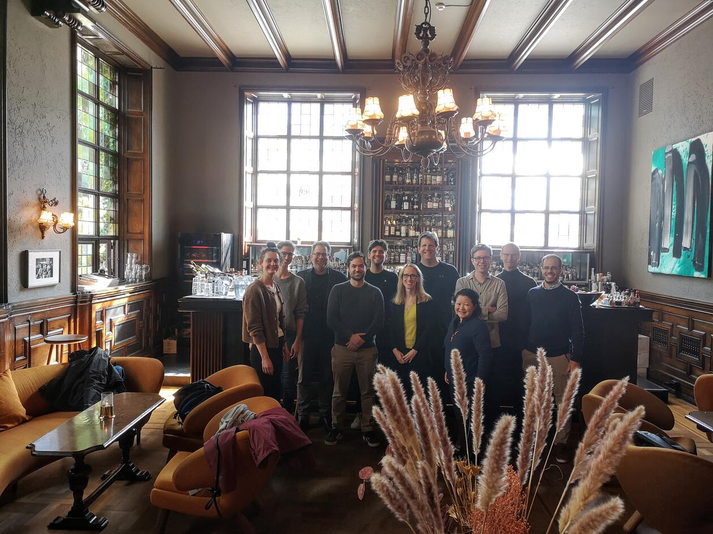

Conference · June 3–4, 2022 · Bergen

Grand Hotel Terminus, Bergen, Norway

The first international conference dedicated exclusively to the configurational comparative method of Coincidence Analysis (CNA).

This conference provides a platform for exchange between CNA methodologists and applied researchers. The newest methodological developments and open questions will be presented alongside exemplary applications from public health, surgical research, social and political science.

<h2>Confirmed speakers</h2>
<ul class="cna-speakers">
<li>Deborah Cragun (Univ. of South Florida) — Practical applications of CNA with real world data: Tips, tricks and areas of confusion</li>
<li>Reiping Huang (Northwestern) — CNA applications in a surgical research center</li>
<li>Tim Haesebrouck (Ghent University) — The populist radical right and military intervention: A CNA of military deployment votes</li>
<li>Jonathan Freitas (Univ. of Minas Gerais) — A roadmap for the coincidence analysis of clustered data</li>
<li>Edward Miech (Regenstrief Institute) — Validating CNA models with sequestered data: A novel application of Coincidence Analysis using a split-sample design</li>
<li>Veli-Pekka Parkkinen (Univ. of Bergen) — Norms of correctness for configurational causal models</li>
<li>Rafael Quintana (Univ. of Kansas) — Embracing complexity in social science research</li>
<li>Martyna Swiatczak (Univ. of Bergen) — Membership inflation in CNA: How over- and underrepresentation of factors affect CNA's performance</li>
<li>Susanne Tafvelin / Ole Henning Sørensen (Umeå Univ. / NFA Denmark) — Identifying conditions contributing to outcomes of a workplace intervention using Coincidence Analysis</li>
<li>Jiji Zhang (Hong Kong Baptist Univ.) — What kind of difference-making should CNA track?</li>
</ul>

<a href="https://m-baum.github.io/docs/programCNA22.pdf">Detailed program and abstracts of the presentations</a>.

<h4>Location</h4>

<iframe src="https://maps.google.com/maps?q=Grand+Hotel+Terminus+Bergen&z=13&output=embed" loading="lazy" referrerpolicy="no-referrer-when-downgrade" allowfullscreen title="Grand Hotel Terminus Bergen"></iframe>
<a href="https://www.google.com/maps/search/?api=1&amp;query=Grand+Hotel+Terminus+Bergen" target="_blank" rel="noopener">Google Maps →</a>

<a href="../events.html">← All events</a>

