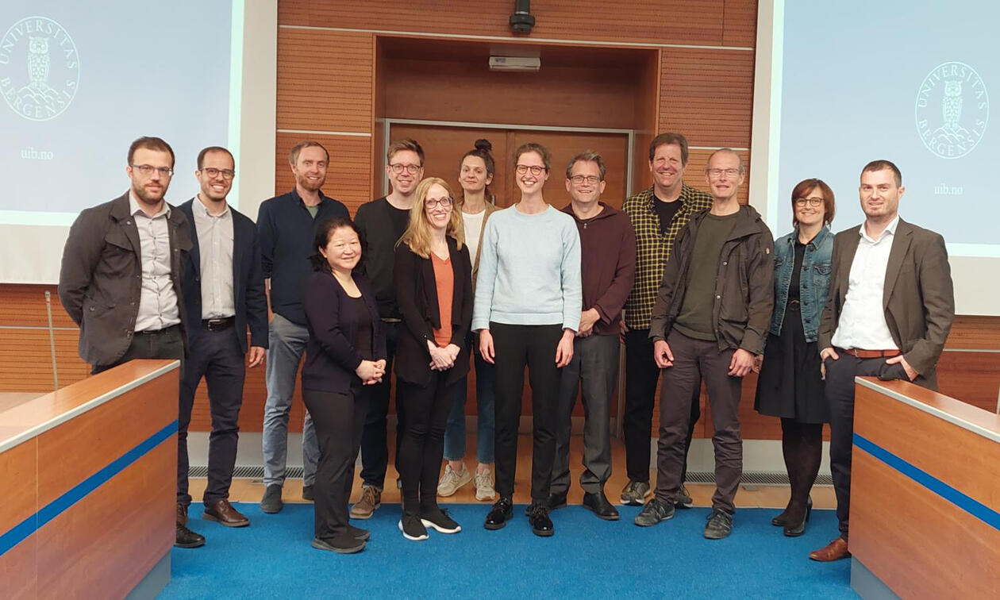

Conference · May 19–20, 2023 · Prague

Prague University of Economics and Business, Czech Republic

The second international conference dedicated exclusively to the configurational comparative method of Coincidence Analysis (CNA).

The second edition of this international conference on Coincidence Analysis provides a platform for exchange between CNA methodologists and applied researchers. The newest methodological developments and open questions will be presented alongside exemplary applications from public health, surgical research, social and political science.

<h2>Confirmed speakers</h2>
<ul class="cna-speakers">
<li>Deborah Cragun (Univ. of South Florida): Real-world examples illustrating challenges and considerations when building, selecting, and presenting CNA models</li>
<li>Jonathan Freitas (Univ. of Minas Gerais): A CNA of CNAs: Searching for causal models of the performance of the method</li>
<li>Reiping Huang (Northwestern): Evaluating the implementation of a multi-component surgical quality collaborative</li>
<li>Edward Miech (Regenstrief Institute): A bottom-up approach to factor selection in CNA: Findings from a reanalysis of three QCA-based studies using the "msc" routine</li>
<li>Veli-Pekka Parkkinen (Univ. of Bergen): Measuring the robustness of CNA models</li>
<li>Martyna Swiatczak (Univ. of Bergen): To Be or Not to Be a Good Leader? A Coincidence Analysis of Identity Leadership, Work-Related Attitudes, and Burnout</li>
<li>Ole Henning Sørensen (NFA Denmark): Simple roads to failure, complex paths to success: An evaluation of conditions explaining perceived fit of an organizational occupational health intervention</li>
<li>Trond Løkling (NTNU Trondheim): What makes workplace conflict deescalate? A Coincidence Analysis on longitudinal panel data</li>
<li>Luna De Souter (Univ. of Bergen): Evaluating Boolean relationships in Configurational Comparative Methods</li>
</ul>

<a href="https://m-baum.github.io/docs/programCNA23.pdf">Tentative program</a>.

<h4>Location</h4>

<iframe src="https://maps.google.com/maps?q=Prague+University+of+Economics+and+Business&z=13&output=embed" loading="lazy" referrerpolicy="no-referrer-when-downgrade" allowfullscreen title="Prague University of Economics and Business"></iframe>
<a href="https://www.google.com/maps/search/?api=1&amp;query=Prague+University+of+Economics+and+Business" target="_blank" rel="noopener">Google Maps →</a>

<h4 style="margin-top:1rem">Photos</h4>
<figure><figcaption>2nd Conference, Prague 2023</figcaption></figure>

<a href="../events.html">← All events</a>

