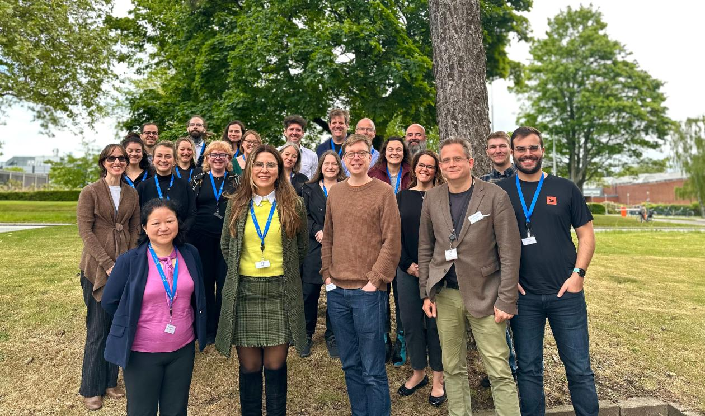

Conference · May 23–24, 2025 · Copenhagen

The National Research Centre for the Working Environment (NFA), Copenhagen

The fourth international conference dedicated exclusively to the configurational comparative method of Coincidence Analysis (CNA).

We are pleased to announce the 4th International Conference on "Current Issues on Coincidence Analysis," scheduled to take place on May 23-24, 2025, at NFA in Copenhagen. This conference serves as a premier platform for the exchange of ideas and collaboration between Coincidence Analysis (CNA) methodologists and applied researchers.

<strong>Conference Scope:</strong> The conference will feature discussions on the latest methodological developments in CNA, addressing open questions and challenges in the field. Moreover, researchers will have the opportunity to showcase exemplary applications of CNA from any discipline as well as theoretical or conceptual developments.

<strong>Highlights:</strong> Invited talks by leading CNA experts · Contributed paper presentations · Networking opportunities in beautiful Copenhagen

<h2>Confirmed speakers</h2>
<ul class="cna-speakers">
<li>Reiping Huang (American College of Surgeons)</li>
<li>Tim Haesebrouck (Ghent University)</li>
<li>Clara Johnson (University of Washington)</li>
<li>Katharina Sterr (Technical University of Munich)</li>
<li>alithia zamantakis (Northwestern University)</li>
<li>Laura Caci (University of Zurich)</li>
<li>Natalie Crimp (University of Virginia)</li>
<li>Ole Henning Sørensen (NFA, Copenhagen)</li>
<li>Deborah Cragun (University of South Florida)</li>
<li>Julio Melo (Techni Methods, Brazil)</li>
</ul>

<a href="https://m-baum.github.io/docs/programCNA25.pdf">Program</a>.

<strong>Conference Venue:</strong> Det Nationale Forskningscenter for Arbejdsmiljø (NFA), Copenhagen.

<strong>Contact</strong>: michael.baumgartner@uib.no.

<h4>Location</h4>

<iframe src="https://maps.google.com/maps?q=National+Research+Centre+for+the+Working+Environment+Copenhagen&z=13&output=embed" loading="lazy" referrerpolicy="no-referrer-when-downgrade" allowfullscreen title="National Research Centre for the Working Environment Copenhagen"></iframe>
<a href="https://www.google.com/maps/search/?api=1&amp;query=National+Research+Centre+for+the+Working+Environment+Copenhagen" target="_blank" rel="noopener">Google Maps →</a>

<h4 style="margin-top:1rem">Photos</h4>
<figure><figcaption>4th Conference, Copenhagen 2025</figcaption></figure>

<a href="../events.html">← All events</a>

