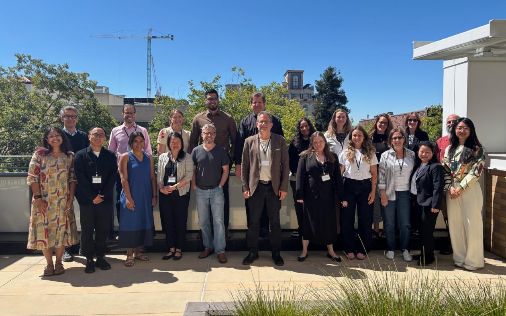

Conference · June 12–13, 2026 · Berkeley

UC Berkeley, School of Social Welfare · venue: Residence Inn by Marriott Berkeley

The fifth international conference dedicated exclusively to the configurational comparative method of Coincidence Analysis (CNA).

We are pleased to announce the 5th International Conference on "Current Issues on Coincidence Analysis," scheduled to take place on June 12-13, 2026, hosted by UC Berkeley, School of Social Welfare, and Peder Sather Center. This conference serves as a premier platform for the exchange of ideas and collaboration between Coincidence Analysis (CNA) methodologists and applied researchers.

<strong>Conference Scope:</strong> The conference will feature discussions on the latest methodological developments in CNA, addressing open questions and challenges in the field. Moreover, researchers will have the opportunity to showcase exemplary applications of CNA from any discipline, as well as theoretical or conceptual developments.

<strong>Highlights:</strong> Invited talks by leading CNA experts · Contributed paper presentations · Networking opportunities

<h2>Confirmed participants</h2>
<ul class="cna-speakers">
<li>Reiping Huang (American College of Surgeons)</li>
<li>Jonathan Freitas (University of Minas Gerais, Brazil)</li>
<li>DeAnne Turner (University of South Florida)</li>
<li>Claude Rubinson (University of Houston-Downtown)</li>
<li>Katharina Sterr (Technical University of Munich, Germany)</li>
<li>Michael Baumgartner (University of Bergen, Norway)</li>
<li>Jessica Dodge (Center for Healthcare Evaluation Research and Promotion, Pittsburgh VA)</li>
<li>Kelly Coates (Oregon Health &amp; Science University - Portland State University School of Public Health)</li>
<li>Edward Miech (Indiana University School of Medicine)</li>
<li>Deborah Cragun (University of South Florida)</li>
<li>Anna Quon (RUSH University, Chicago)</li>
</ul>

<a href="https://m-baum.github.io/docs/programCNA26.pdf">Program with abstracts</a>.

<strong>Conference Venue:</strong> Residence Inn by Marriott Berkeley.

<strong>Contact</strong>: michael.baumgartner@uib.no.

<h4>Location</h4>

<iframe src="https://maps.google.com/maps?q=Residence+Inn+by+Marriott+Berkeley&z=13&output=embed" loading="lazy" referrerpolicy="no-referrer-when-downgrade" allowfullscreen title="Residence Inn by Marriott Berkeley"></iframe>
<a href="https://www.google.com/maps/search/?api=1&amp;query=Residence+Inn+by+Marriott+Berkeley" target="_blank" rel="noopener">Google Maps →</a>

<h4 style="margin-top:1rem">Photos</h4>
<figure><figcaption>5th Conference, Berkeley 2026</figcaption></figure>

<a href="../events.html">← All events</a>

