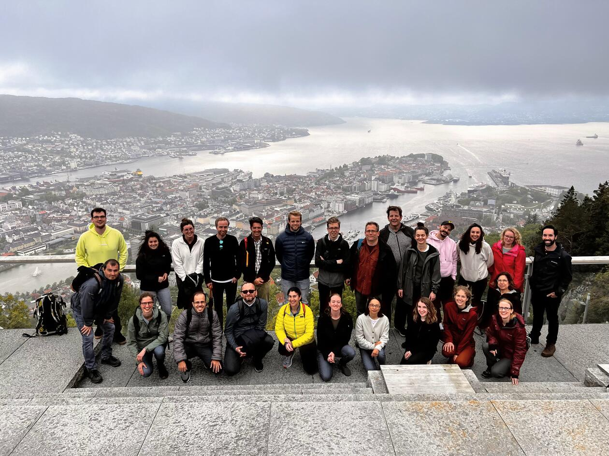

Training · May 30 – Jun 2, 2022 · Bergen

Grand Hotel Terminus, Bergen, Norway

Learning causal data analysis with Coincidence Analysis from the ground up.

This workshop offers an intensive 4-day introduction to causal modeling with Coincidence Analysis (CNA), a relatively new configurational comparative method of data analysis geared towards causal complexity, which has seen a considerable uptick in applications in recent years. No prior knowledge of CNA is required.

In plenary lectures, the main developer of CNA, Michael Baumgartner, and a team of experienced CNA methodologists and practitioners will guide participants through the nuts and bolts of configurational data analysis as well as cutting-edge methodological innovations. In smaller practice groups, the instructors will demonstrate how to make the most of current software for CNA and offer advice on practical issues, such as getting funded and published with CNA.

From Boolean algebra and the philosophical roots of regularity theories of causation, over the basic ideas behind CNA's search algorithm, and measures of fit to multi-outcome structures, model ambiguities, and robustness analyses this introduction will enable participants to conduct CNA analyses themselves and review those of other researchers in a sophisticated manner.

In addition, this will be an opportunity to get to know researchers working with and on CNA from all over the world. There will be social activities around the city of Bergen, which is particularly beautiful at this time of the year.

On the two days after the workshop (i.e. June 3-4), there will be a conference on CNA at the same venue in Bergen. Participants of the training workshop will be invited to attend that conference as well. Moreover, the instructors will remain available for consultation after the event to help participants with the methodological and practical aspects of their research projects.

<h2>Practical information</h2>
<ul>
<li><strong>Dates:</strong> 30 May – 2 June, 2022, Grand Hotel Terminus, Bergen Norway</li>
<li><strong>Registration deadline:</strong> 2 May, 2022</li>
<li><strong>Main instructor:</strong> Michael Baumgartner, University of Bergen, Norway</li>
<li><strong>Additional presentations by:</strong> Deborah Cragun, University of South Florida, USA; Edward Miech, Regenstrief Institute, USA; Veli-Pekka Parkkinen, University of Bergen, Norway; Martyna Swiatczak, University of Bergen, Norway</li>
</ul>
<h2>Participation, Registration, Tuition</h2>

Registration is open. Given that Covid restrictions have all been lifted in Norway, we are confident that this event can take place in person. The ordinary course fee is NOK 5400, which is approximately €540 or $610. The fee includes tuition as well as lunches, coffee break catering, and one workshop dinner. We can offer a certain amount of tuition scholarships to people without sufficient institutional funding (grad students, post-docs, etc.) and we have special arrangements for participants from Norwegian universities. If you are interested in a scholarship or have an affiliation with a Norwegian university, write to michael.baumgartner@uib.no for more information.

After successful completion of the course, we can provide participation certificates to those interested, stating, among other things, that the course is worth 5 ECTS points (e.g. to PhD students).

Registration does not require payment at this time. Once we are certain that the course can be held as planned, we will send out payment links to all registered. Space is limited. There will be a waiting list, once all enrollment slots are reserved. For questions, please, write to michael.baumgartner@uib.no.

<h4>Location</h4>

<iframe src="https://maps.google.com/maps?q=Grand+Hotel+Terminus+Bergen&z=13&output=embed" loading="lazy" referrerpolicy="no-referrer-when-downgrade" allowfullscreen title="Grand Hotel Terminus Bergen"></iframe>
<a href="https://www.google.com/maps/search/?api=1&amp;query=Grand+Hotel+Terminus+Bergen" target="_blank" rel="noopener">Google Maps →</a>

<a href="../events.html">← All events</a>

