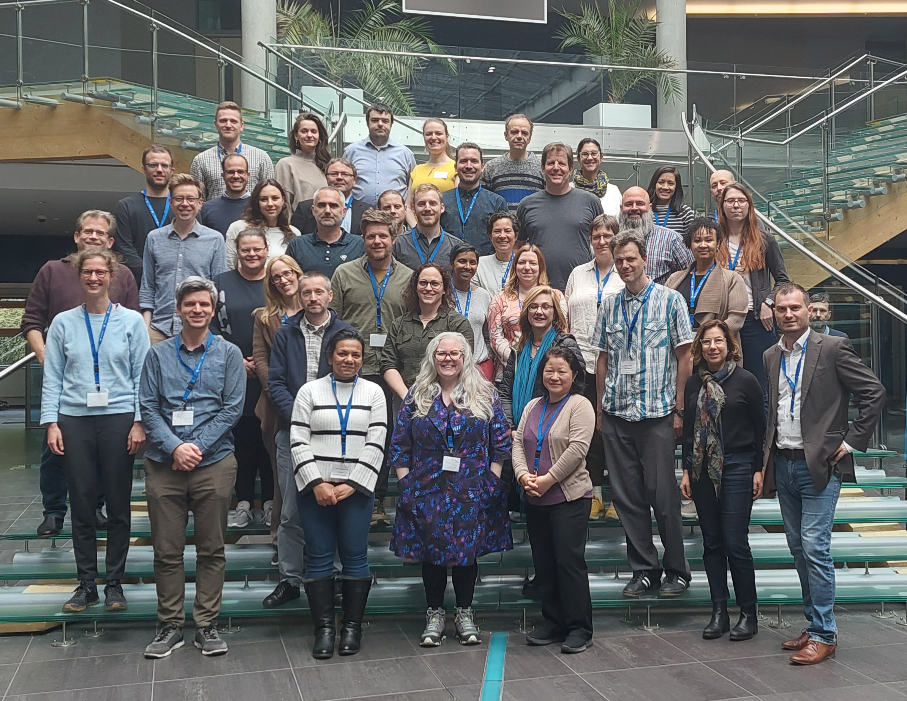

Training · May 15–18, 2023 · Prague

Prague University of Economics and Business, Czech Republic

Learning causal data analysis with Coincidence Analysis from the ground up.

This workshop offers an intensive 4-day introduction to causal modeling with Coincidence Analysis (CNA), a relatively new configurational comparative method of data analysis geared towards causal complexity, which has seen a considerable uptick in applications in recent years. No prior knowledge of CNA is required.

In plenary lectures, the main developer of CNA, Michael Baumgartner, and a team of experienced CNA methodologists and practitioners will guide participants through the nuts and bolts of configurational data analysis as well as cutting-edge methodological innovations. In smaller practice groups, the instructors will demonstrate how to make the most of current software for CNA and offer advice on practical issues, such as getting funded and published with CNA.

From Boolean algebra and the philosophical roots of regularity theories of causation, over the basic ideas behind CNA's search algorithm, and measures of fit to multi-outcome structures, model ambiguities, and robustness analyses this introduction will enable participants to conduct CNA analyses themselves and review those of other researchers in a sophisticated manner.

In addition, this will be an opportunity to get to know researchers working with and on CNA from all over the world—in one of the most beautiful cities in Europe: Prague.

On the two days after the workshop (i.e. May 19-20), there will be a conference on CNA at the same venue in Prague. Participants of the training workshop will be invited to attend that conference as well. Moreover, the instructors will remain available for consultation after the event to help participants with the methodological and practical aspects of their research projects.

<h2>Practical information</h2>
<ul>
<li><strong>Dates:</strong> May 15 – 18, 2023, Prague University of Economics and Business</li>
<li><strong>Registration deadline:</strong> April 28, 2023</li>
<li><strong>Main instructor:</strong> Michael Baumgartner, University of Bergen, Norway</li>
<li><strong>Additional presentations by:</strong> Deborah Cragun, University of South Florida, USA; Edward Miech, Regenstrief Institute, USA; Veli-Pekka Parkkinen, University of Bergen, Norway; Luna De Souter, University of Bergen, Norway; Martyna Swiatczak, University of Bergen, Norway</li>
</ul>
<h2>Participation, Registration, Tuition</h2>

Registration is open. As the financial side of the course is organized through the University of Bergen, course fees are in NOK. The early-bird fee for registrations no later than February 10, 2023, is NOK 4800 (ca. €460/$485), the standard fee for later registrations is NOK 5200 (ca. €500/$525).

The fee includes tuition as well as lunches, coffee break catering, and one workshop dinner. We can offer a small amount of tuition scholarships to people without sufficient institutional funding (grad students, post-docs, etc.) and for participants from the Prague University of Economics and Business (VŠE), Faculty of Finance and Accounting. If you are interested in a scholarship, write to michael.baumgartner@uib.no for more information.

After successful completion of the course, we can provide participation certificates to those interested, stating, among other things, that the course is worth 5 ECTS points (e.g. to PhD students).

Space is limited. There will be a waiting list, once all enrolment slots are reserved. For questions, please, write to michael.baumgartner@uib.no.

This course is co-organized by the Prague University of Economics and Business, Faculty of Finance and Accounting, and the Department of Philosophy of the University of Bergen.

<h4>Location</h4>

<iframe src="https://maps.google.com/maps?q=Prague+University+of+Economics+and+Business&z=13&output=embed" loading="lazy" referrerpolicy="no-referrer-when-downgrade" allowfullscreen title="Prague University of Economics and Business"></iframe>
<a href="https://www.google.com/maps/search/?api=1&amp;query=Prague+University+of+Economics+and+Business" target="_blank" rel="noopener">Google Maps →</a>

<h4 style="margin-top:1rem">Photos</h4>
<figure><figcaption>CNA training 2023, Prague</figcaption></figure>

<a href="../events.html">← All events</a>

