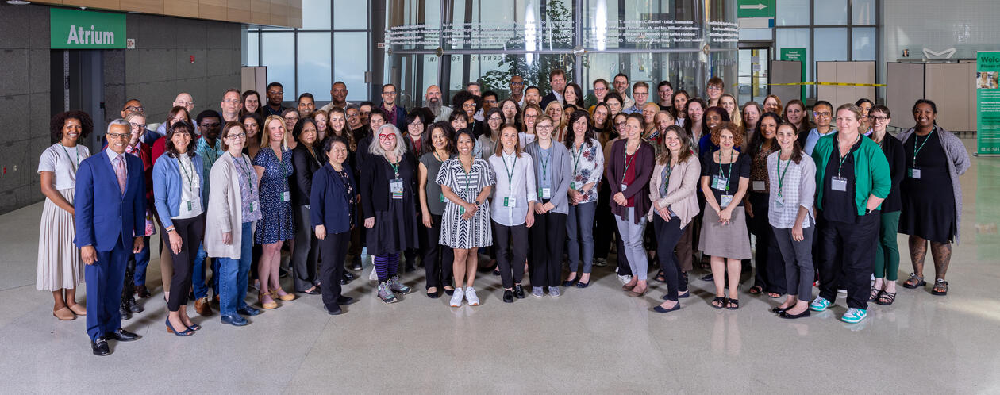
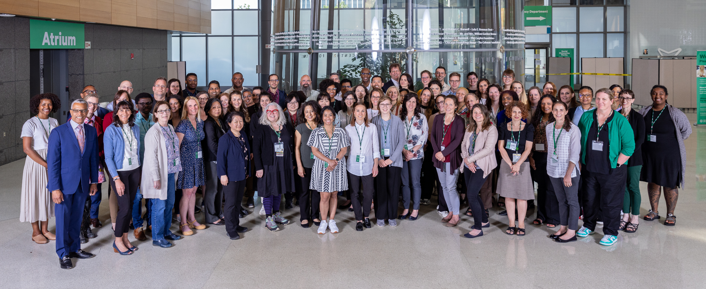
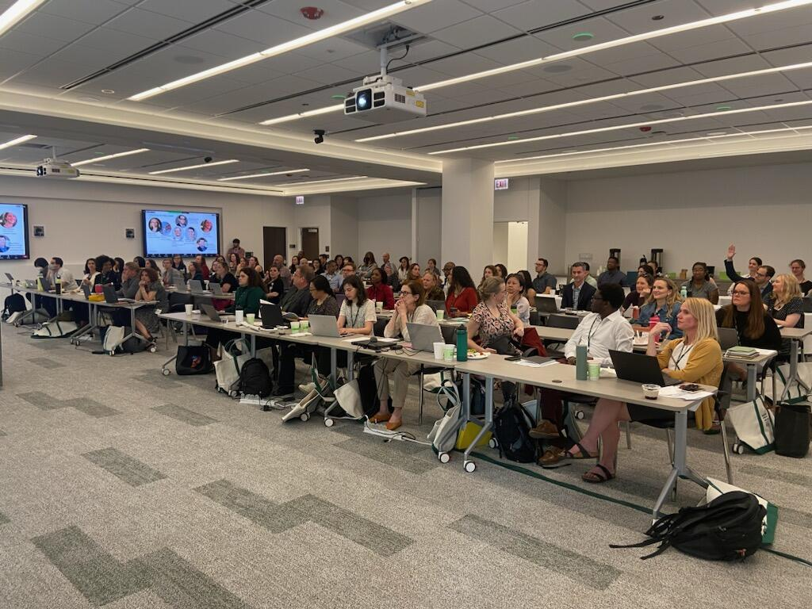

Training · May 20–23, 2024 · Chicago

Rush University, Chicago

Learning causal data analysis with Coincidence Analysis from the ground up, with practical application to health equity and health services.

This workshop offers an intensive 4-day introduction to causal modeling with Coincidence Analysis (CNA), a novel configurational comparative method of data analysis geared towards causal complexity, which has seen a considerable uptick in applications in recent years. No prior knowledge of CNA is required.

In plenary lectures, the main developer of CNA, Michael Baumgartner, and a team of experienced CNA methodologists and practitioners will guide participants through the nuts and bolts of configurational data analysis as well as cutting-edge methodological innovations. In smaller practice groups, the instructors will demonstrate how to make the most of current software for CNA and offer advice on practical issues, such as getting funded and published with CNA.

From Boolean algebra and the philosophical roots of regularity theories of causation, over the basic ideas behind CNA's search algorithm, and measures of fit to multi-outcome structures, model ambiguities, and robustness analyses this introduction will enable participants to conduct CNA analyses themselves and review those of other researchers in a sophisticated manner. This will also be an opportunity to get to know researchers working with and on CNA from all over the world.

The workshop is hosted and organized by RUSH University Medical Center Department of Emergency Medicine and RUSH BMO Institute for Health Equity.

<h2>Registration</h2>

For more details and registration, go to <a href="https://rushu.rush.edu/cna2024">https://rushu.rush.edu/cna2024</a>.

<h4>Location</h4>

<iframe src="https://maps.google.com/maps?q=Rush+University+Chicago&z=13&output=embed" loading="lazy" referrerpolicy="no-referrer-when-downgrade" allowfullscreen title="Rush University Chicago"></iframe>
<a href="https://www.google.com/maps/search/?api=1&amp;query=Rush+University+Chicago" target="_blank" rel="noopener">Google Maps →</a>

<h4 style="margin-top:1rem">Photos</h4>
<figure><figcaption>Chicago training 2024</figcaption></figure>
<figure><figcaption>Chicago training</figcaption></figure>

<a href="../events.html">← All events</a>

