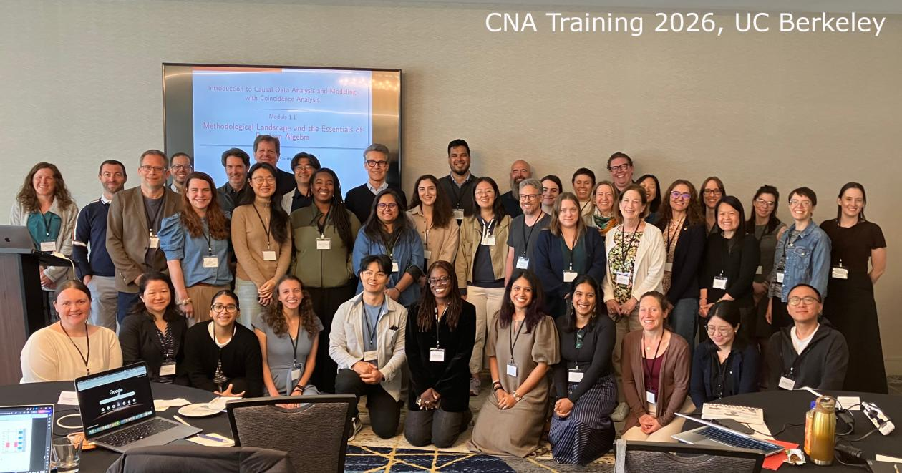
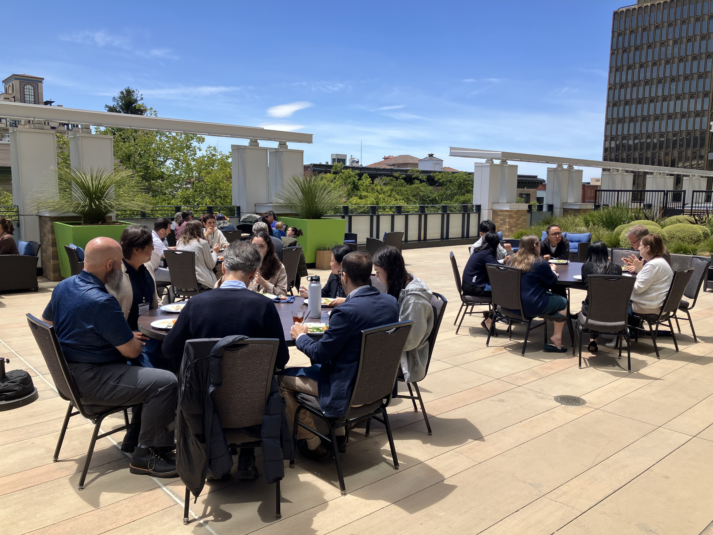

Training · June 8–11, 2026 · Berkeley

UC Berkeley, School of Social Welfare

Learning causal data analysis with Coincidence Analysis from the ground up.

This workshop offers an intensive 4-day introduction to causal modeling with Coincidence Analysis (CNA), a novel configurational comparative method of data analysis geared towards causal complexity, which has seen a considerable uptick in applications in recent years. No prior knowledge of CNA is required.

In plenary lectures, the main developer of CNA, Michael Baumgartner, and a team of experienced CNA methodologists and practitioners will guide participants through the nuts and bolts of configurational data analysis as well as cutting-edge methodological innovations. In smaller practice groups, the instructors will demonstrate how to make the most of current software for CNA and offer advice on practical issues, such as getting funded and published with CNA.

From Boolean algebra and the philosophical roots of regularity theories of causation, over the basic ideas behind CNA's search algorithm, and measures of fit to multi-outcome structures, model ambiguities, and robustness analyses this introduction will enable participants to conduct CNA analyses themselves and review those of other researchers in a sophisticated manner. This will also be an opportunity to get to know researchers working with and on CNA from all over the world.

The workshop is organized by UC Berkeley and the Peder Sather Center.

<h2>Practical information</h2>
<ul>
<li><strong>Dates:</strong> June 8 – 11, 2026, UC Berkeley, School of Social Welfare</li>
<li><strong>Main instructor:</strong> Michael Baumgartner, University of Bergen, Norway</li>
<li><strong>Additional presentations by:</strong> Deborah Cragun, University of South Florida, USA; Edward Miech, Indiana University School of Medicine, USA; Reiping Huang, American College of Surgeons, USA; Jonathan Freitas, University of Minas Gerais, Brazil; Kelly Coates (Oregon Health &amp; Science University - Portland State University School of Public Health); Jessica Dodge (Center for Healthcare Evaluation Research and Promotion, Pittsburgh VA)</li>
</ul>
<h2>Registration and fees</h2>

Early bird fee for registration prior to January 31, 2026 is $850. Standard registration (February 1, 2026 - April 15, 2026) is $950. Late registration (April 16th 2026 - May 15th, 2026) is $1050. Registration fees include tuition as well as morning and afternoon snack, lunch, and one workshop dinner (Monday, June 8th).

For more details and registration go to <a href="https://mackcenter.berkeley.edu/2026-cna-workshop">https://mackcenter.berkeley.edu/2026-cna-workshop</a>.

<h4>Location</h4>

<iframe src="https://maps.google.com/maps?q=UC+Berkeley+School+of+Social+Welfare&z=13&output=embed" loading="lazy" referrerpolicy="no-referrer-when-downgrade" allowfullscreen title="UC Berkeley School of Social Welfare"></iframe>
<a href="https://www.google.com/maps/search/?api=1&amp;query=UC+Berkeley+School+of+Social+Welfare" target="_blank" rel="noopener">Google Maps →</a>

<h4 style="margin-top:1rem">Photos</h4>
<figure><figcaption>Berkeley training 2026</figcaption></figure>
<figure><figcaption>Berkeley training 2026</figcaption></figure>

<a href="../events.html">← All events</a>

