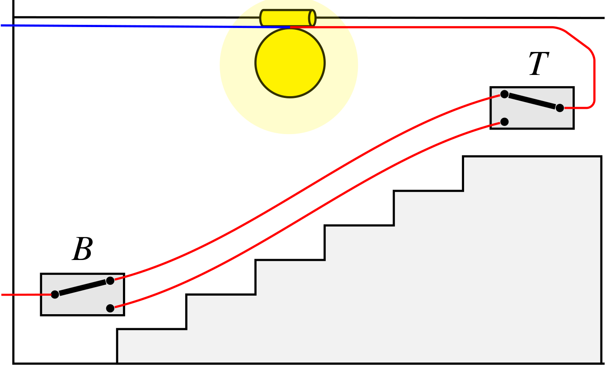

<iframe src="assets/graph.html" title="Illustration of a CNA causal structure" loading="lazy"></iframe>

## Origins & Overview

CNA was first introduced in [Baumgartner (2009a)](http://www.springerlink.com/content/x0487831qk67h455/) and [(2009b)](http://smr.sagepub.com/cgi/content/abstract/38/1/71), substantively re-worked and generalized in [Baumgartner and Ambühl (2020)](https://doi.org/10.1017/psrm.2018.45), and implemented in the software libraries [cna](software.html), [frscore](software.html), [cnaOpt](software.html), and [causalHyperGraph](software.html) for the R environment for statistical computing. In recent years, CNA was applied in many studies in public health as well as in the social, political, and behavioral sciences, and its dissemination is growing rapidly. An overview of the literature is provided [here](literature.html) and in the [CNA Zotero library](https://www.zotero.org/groups/4567107/coincidence.analysis/library).

## The Basis of CNA

The effects of causes can be highly context-sensitive. A medical treatment may cure one patient and harm another; a social policy may foster prosperity in one country and trigger a crisis in the next. Whether some factor *X* brings about an effect *Y*~1~, a different effect *Y*~2~, or nothing at all depends on the complex configuration of other factors that co-occur with *X*. This context-sensitivity of causation is due to the phenomenon of *causal complexity*: causes act in bundles and operate on alternative causal paths.

<figure class="cna-figure">

<figcaption>A staircase light: the light is on only when both switches are in the same position.</figcaption>
</figure>

One consequence of causal complexity is that individual causes and their context-sensitive effects can lack pairwise dependence (e.g. correlation). As a simple illustration, consider a staircase light operated by two switches, one at the top of the stairs, *T*, and the other at the bottom, *B*, each of which can be in two positions, *up* and *down* (see figure). The light is on if both switches are in the same position (*up*/*up* or *down*/*down*), and off when they are in opposite positions. In the long term, the positions of the individual switches will be uncorrelated with (i.e. independent of) the light; still, the individual switch positions *in the right configurations* (i.e. in the right context) are causes of the light.

Standard methods of causal learning, such as those using regression techniques or Bayesian networks, struggle to learn such structures, even from ideal, noise-free data. The reason is that they are built on theories of causation that treat pairwise dependence between two factors *X* and *Y* as necessary for a causal connection. Consequently, standard methods infer that *X* is not a cause of *Y* if *X* and *Y* are not dependent (e.g. [Spirtes et al. 2000](https://direct.mit.edu/books/monograph/2057/Causation-Prediction-and-Search)), which is clearly mistaken when analyzing data on the staircase light. Although there exist protocols for tracing interaction effects among two or three factors, interaction analyses are not conducted in the absence of pairwise correlation and quickly become computationally intractable as the number of factors grows ([Brambor et al. 2006](https://doi.org/10.1093/pan/mpi014)). Standard methods are not designed to bundle causes into configurations (or contexts); rather, their aim is to quantify effect sizes of individual causes. Learning causal complexity from data calls for a method that tracks causation as defined by a theory not requiring a dependence between individual causes and effects and that embeds individual causes in complex Boolean AND- and OR-functions over many other causes, fitting those functions to the data as a whole.

This is the purpose of Coincidence Analysis (CNA). CNA takes data on binary, multi-value, or continuous (fuzzy-set) factors and infers causal structures as defined by a modern regularity theory of causation ([Mackie 1974](https://oxford.universitypressscholarship.com/view/10.1093/0198246420.001.0001/acprof-9780198246428); [Baumgartner and Falk 2023](https://www.journals.uchicago.edu/doi/10.1093/bjps/axz047); [Zhang and Zhang 2023](https://doi.org/10.1007/s10670-023-00685-4)), which defines causation in terms of redundancy-free Boolean regularity patterns among factors and, crucially, does not require causes to be pairwise dependent with their effects. CNA groups causes conjunctively (in complex bundles that must act together) and disjunctively (as alternative pathways to an effect), and outputs configurational models: redundancy-free Boolean expressions that capture the complex configurations of factors through which effects are brought about. CNA belongs to a family of complexity-learning methods — together with Qualitative Comparative Analysis (QCA; e.g. [Ragin 2008](https://press.uchicago.edu/ucp/books/book/chicago/R/bo5973952.html)) and Logic Regression (LR; e.g. [Ruczinski et al. 2003](https://research.fredhutch.org/content/dam/stripe/kooperberg/2003logic.pdf)) — but it is the only one of its kind that can process data generated by causal structures with more than one outcome, and hence can analyze causal chains and cycles. Moreover, unlike the models of QCA and Logic Regression, CNA's models are guaranteed to be redundancy-free, which makes them directly causally interpretable, and CNA is more successful than any related method at exhaustively uncovering all configurational models that fit the data equally well.

