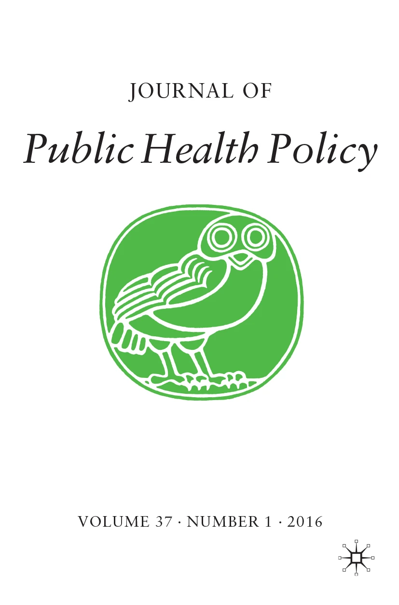
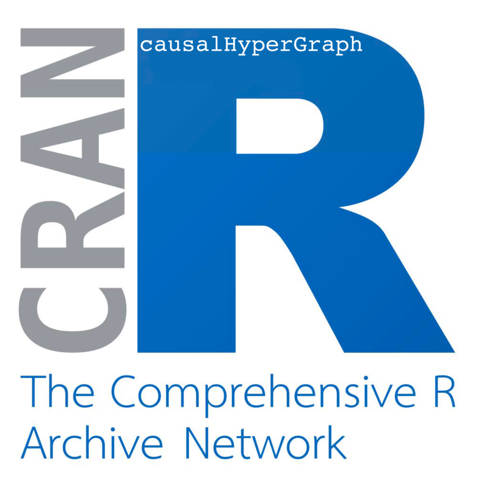
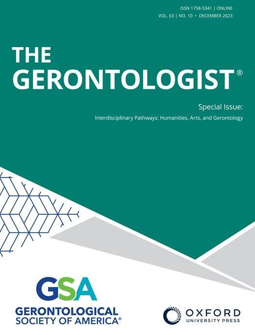
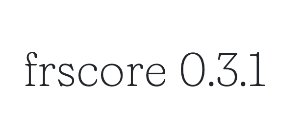
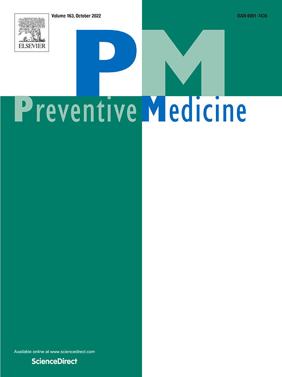
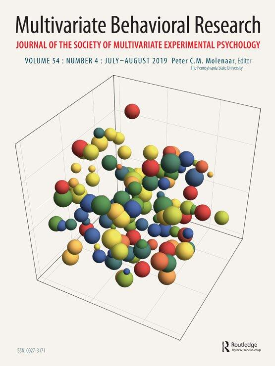
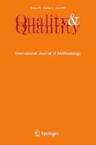

Information about new publications, applications, software releases, training activities, and projects.

<article class="cna-news-item">

04.08.2026

<h3><a href="news/cna-applied-in-environmental-psychology.html">CNA applied in Environmental Psychology</a></h3>

Henrik Johansson Rehn, Alexandre Sukhov, Lars E. Olsson, and Margareta Friman use CNA to explore the "window of opportunity" for car use reduction and to identify the causal pathways that lead people to reduce their car use.

</article>
<article class="cna-news-item">

03.08.2026

<h3><a href="news/cna-applied-in-firearm-policy.html">How local prevention efforts and state regulations reduce fatal shootings</a></h3>

Daniel C. Semenza, Edward J. Miech, Brielle Savage, and Devon Ziminski use CNA to examine how combinations of city-level prevention efforts and state-level firearm policies link to fatal shooting rates across 100 US cities.

</article>
<article class="cna-news-item">

19.06.2026

<h3><a href="news/factor-selection-guidance-for-configurational-comparative-methods.html">Guidance for factor selection in configurational comparative analysis</a></h3>

Laura Caci, Kathrin Blum, Lauren Clack, and Bianca Albers provide guidance on selecting factors for Coincidence Analysis and other configurational comparative methods, offering a four-stage approach for implementation researchers.

</article>
<article class="cna-news-item">

17.04.2026

<h3><a href="news/cna-applied-in-chicago-life-expectancy.html">CNA applied to low life expectancy in Chicago</a></h3>

John Rich, Edward Miech, and colleagues apply CNA to identify the social factors that link to low life expectancy across Chicago's 77 community areas, finding that low birth weight, unemployment, and non-fatal shootings combine across alternative pathways to the outcome.

</article>
<article class="cna-news-item">

03.11.2025

<h3><a href="news/cna-introduced-for-causal-learning-in-vaccination-settings.html">CNA introduced for causal learning in vaccination settings</a></h3>

Abdu A. Adamu and colleagues introduced CNA as a tool to improve immunization decision-making and address disparities in vaccination coverage, arguing that CNA can help immunization stakeholders better understand impleme

</article>
<article class="cna-news-item">

03.11.2025

<h3><a href="news/exemplary-application-of-cna-in-democracy-research.html">Exemplary application of CNA in democracy research</a></h3>

Jesse Rhodes delivers an exemplary study applying Coincidence Analysis (CNA) to discover causal paths leading to substantial improvement in subnational democracy in the U.S. states.

</article>
<article class="cna-news-item">

07.08.2025

<h3><a href="news/cna-taught-at-two-training-workshops-in-asia.html">CNA taught at two training workshops in Asia</a></h3>

In July 2025, the PATANG team at The George Institute for Global Health (TGI) organized two CNA training workshops in Asia: one in Bali, Indonesia, in collaboration with the International Health Economics Association (IH

</article>
<article class="cna-news-item">

22.04.2025

<h3><a href="news/cna-applied-in-surgery.html">CNA applied in surgery</a></h3>

Reiping Huang and colleagues applied CNA in the field of surgery and published their results in the world's most highly referenced surgery journal: Annals of Surgery. Their study explains the successful implementation of

</article>
<article class="cna-news-item">

06.04.2025

<h3><a href="news/new-r-package-for-drawing-causal-hypergraphs.html">New R package for drawing causal Hypergraphs</a></h3>

Christoph Falk, Mathias Ambühl, and Michael Baumgartner released a new R package called causalHyperGraph on CRAN. It draws causal Hypergraphs from solution formulas of the CNA method.

</article>
<article class="cna-news-item">

06.04.2025

<h3><a href="news/version-4-0-0-of-the-cna-r-package-released-on-cran.html">Version 4.0.0 of the cna R package released on CRAN</a></h3>

Mathias Ambühl and Michael Baumgartner released version 4.0.0 of the cna R package on CRAN. Many new measures for sufficiency and necessity evaluation are now available for CNA model building.

</article>
<article class="cna-news-item">

07.03.2025

<h3><a href="news/cna-applied-in-implementation-science.html">CNA applied in Implementation Science</a></h3>

Emmeline Chuang and colleagues applied CNA in a mixed methods analysis to identify the conditions under which collaboration strategies affect implementations of cross-systems interventions for child welfare and substance

</article>
<article class="cna-news-item">

07.03.2025

<h3><a href="news/cna-applied-in-cancer-medicine.html">CNA applied in Cancer Medicine</a></h3>

Mandi L. Pratt-Chapman and colleagues applied CNA to identify key difference-makers distinguishing oncology institutions that collect sexual orientation and gender identity (SOGI) data across a sample of American Society

</article>
<article class="cna-news-item">

05.12.2024

<h3><a href="news/cna-course-at-the-university-of-sao-paulo.html">CNA course at the University of São Paulo</a></h3>

On October 10 and 11, 2024, Dr. Jonathan Freitas (UFMG/Brazil) conducted an introductory CNA course at the Clinical Hospital of the School of Medicine at the University of São Paulo (HC/FMUSP). The course brought togethe

</article>
<article class="cna-news-item">

28.11.2024

<h3><a href="news/cna-applied-in-peace-research.html">CNA applied in Peace Research</a></h3>

Jordan Becker, Paul Poast, and Tim Haesebrouck combined CNA with Regression Analysis in a mixed method approach to investigate why countries with disparate geography and perceptions of the international security environm

</article>
<article class="cna-news-item">

17.08.2024

<h3><a href="news/new-publication-from-the-cna-group.html">New publication from the CNA group</a></h3>

Michael Baumgartner and Christoph Falk published a paper entitled "Quantifying the quality of configurational causal models" in the Journal of Causal Inference. The paper introduces quantitative quality criteria for caus

</article>
<article class="cna-news-item">

17.08.2024

<h3><a href="news/cna-applied-in-genetics-in-medicine.html">CNA applied in Genetics in Medicine</a></h3>

Deborah Cragun, Zachary M. Salvati, Jennifer L. Schneider, et al. use CNA to identify factors and causal chains associated with optimal implementation of Lynch syndrome tumor screening.

</article>
<article class="cna-news-item">

12.06.2024

<h3><a href="news/updates-for-r-packages-cna-and-frscore.html">Updates for R packages CNA and FRSCORE</a></h3>

Version 3.6.2 of the cna R package was released on CRAN, accompanied by a minor adjustment of the frscore package. Both updates should be installed.

</article>
<article class="cna-news-item">

31.05.2024

<h3><a href="news/cna-applied-in-psychology.html">CNA applied in Psychology</a></h3>

Marta Roczniewska, Ole Henning Sørensen, Susanne Tafvelin et al. use CNA to invesitigate the causes of how employees perceive the relevance of health interventions at the workplace.

</article>
<article class="cna-news-item">

31.05.2024

<h3><a href="news/cna-applied-in-gerontology.html">CNA applied in Gerontology</a></h3>

Chava Pollak, Joe Verghese, Helena M Blumen use CNA to identify combinations of social factors that make a difference for frailty among older adults.

</article>
<article class="cna-news-item">

15.01.2024

<h3><a href="news/new-measures-for-evaluating-cna-models.html">New measures for evaluating CNA models</a></h3>

Luna De Souter identifies shortcomings of the two main measures for evaluating CNA models, consistency and coverage, and introduces two new evaluation measures.

</article>
<article class="cna-news-item">

25.08.2023

<h3><a href="news/update-3-5-4-of-the-cna-r-package-released-on-cran.html">Update 3.5.4 of the cna R package released on CRAN</a></h3>

Mathias Ambühl and Michael Baumgartner released a new update of the cna R package on CRAN. The latest version is 3.5.4.

</article>
<article class="cna-news-item">

25.08.2023

<h3><a href="news/cna-applied-in-genetics-in-medicine-1.html">CNA applied in Genetics in Medicine</a></h3>

Dean, M, Tezak, A, Johnson, S, ... Cragun, D. used CNA to identify factors differentiating cancer risk management decisions among females with pathogenic/likely pathogenic variants in PALB2, CHEK2, and ATM. Accompanied b

</article>
<article class="cna-news-item">

22.06.2023

<h3><a href="news/cna-applied-in-general-internal-medicine.html">CNA applied in General Internal Medicine</a></h3>

Jessica Dodge et al. (2023) conducted a Coincidence Analysis investigating various factors influencing timely implementation of research findings into clinical practice in the Veterans Health Administration (VHA).

</article>
<article class="cna-news-item">

22.05.2023

<h3><a href="news/cna-applied-in-editor-s-choice-article-of-translational-behavioral-med.html">CNA applied in "Editor's Choice" article of Translational Behavioral Medicine</a></h3>

Laura J Damschroder et al. (2022) conducted a Coincidence Analysis of obesity treatment options within the Veterans Health Administration, which was selected "Editor's Choice" by Translational Behavioral Medicine.

</article>
<article class="cna-news-item">

03.05.2023

<h3><a href="news/version-0-3-1-of-frscore-is-released.html">Version 0.3.1 of `frscore` is released</a></h3>

A new version of the `frscore` extension package for `cna` is now available on CRAN.

</article>
<article class="cna-news-item">

10.04.2023

<h3><a href="news/template-application-of-the-frscore-routine.html">Template application of the frscore routine</a></h3>

Tim Haesebrouck applied the frscore routine in an exemplary manner to examine the conditions under which populist radical right parties support military deployment decisions in national parliaments: Haesebrouck T. (2023)

</article>
<article class="cna-news-item">

29.09.2022

<h3><a href="news/new-geoconfiguational-application-of-cna.html">New geoconfiguational application of CNA</a></h3>

John Rich, Edward Miech, Daniel Semenza and Theodore Corbin applied CNA in a new study investigating the effect of 10 firearm laws in US states on homocide and suicide rates.

</article>
<article class="cna-news-item">

19.09.2022

<h3><a href="news/frscore-news-tips-and-tricks.html">frscore news, tips and tricks</a></h3>

In a series of news articles, Veli-Pekka Parkkinen informs about new developments concerning the frscore package for CNA robustness analysis. To make the best of frscore, users are encouraged to follow these updates.

</article>
<article class="cna-news-item">

07.09.2022

<h3><a href="news/coincidence-analysis-introduced-to-medical-informatics.html">Coincidence Analysis introduced to medical informatics</a></h3>

The data analysis method of Coincidence Analysis has been introduced to the field of medical informatics: Womack DM, Miech EJ, Fox NJ, Silvey LC, Somerville AM, Eldredge DH, Steege LM. (2022), Coincidence Analysis: A Nov

</article>
<article class="cna-news-item">

30.08.2022

<h3><a href="news/international-visiting-fellowship-for-martyna-swiatczak.html">International Visiting Fellowship for Martyna Swiatczak</a></h3>

Martyna Swiatczak is visiting the University of Frankfurt for three months.

</article>
<article class="cna-news-item">

07.06.2022

<h3><a href="news/new-publication-of-the-cna-group.html">New publication of the CNA group</a></h3>

Veli-Pekka Parkkinen argues that variable relativity is good, in a paper that recently appeared in Synthese: Parkkinen, VP. Variable relativity of causation is good. Synthese 200, 194 (2022). https://doi.org/10.1007/s112

</article>
<article class="cna-news-item">

24.01.2022

<h3><a href="news/new-member-of-the-cna-group.html">New member of the CNA group</a></h3>

The CNA group has the pleasure to welcome Luna de Souter to the team.

</article>
<article class="cna-news-item">

01.10.2021

<h3><a href="news/new-publication-of-the-cna-group-1.html">New publication of the CNA group</a></h3>

Martyna Swiatczak's paper entitled "Towards a neo-configurational theory of intrinsic motivation" was published in Motivation and Emotion (2021): https://doi.org/10.1007/s11031-021-09906-1

</article>
<article class="cna-news-item">

01.10.2021

<h3><a href="news/new-publication-of-the-cna-group-2.html">New publication of the CNA group</a></h3>

Michael Baumgartner and Christoph Falk published a paper entitled "Configurational Causal Modeling and Logic Regression" in Multivariate Behavioral Research (2021): https://doi.org/10.1080/00273171.2021.1971510

</article>
<article class="cna-news-item">

20.08.2021

<h3><a href="news/new-software-from-the-coincidence-analysis-group-1.html">New Software from the "Coincidence Analysis" Group</a></h3>

New CNA software published on The Comprehensive R Archive Network.

</article>
<article class="cna-news-item">

16.08.2021

<h3><a href="news/new-publication-of-the-cna-group-4.html">New publication of the CNA group</a></h3>

Martyna Swiatczak's paper on "Different algorithms, different models" was published in Quality &amp; Quantity (2021): https://doi.org/10.1007/s11135-021-01193-9

</article>
<article class="cna-news-item">

24.06.2021

<h3><a href="news/fripro-project-granted.html">FRIPRO project granted</a></h3>

The CNA group is very happy to announce that the Research Council of Norway (Forskningsrådet) will fund the further development of CNA with NOK 12,000,000 (about 1,2 M EUR) over the coming years.

</article>
<article class="cna-news-item">

23.06.2021

<h3><a href="news/new-publication-of-the-cna-group-3.html">New publication of the CNA group</a></h3>

Michael Baumgartner's paper on "Qualitative Comparative Analysis and robust sufficiency" was published in Quality &amp; Quantity (2021): https://doi.org/10.1007/s11135-021-01157-z

</article>
<article class="cna-news-item">

03.06.2021

<h3><a href="news/new-publication-from-the-cna-group-2.html">New publication from the CNA group</a></h3>

A procedure for optimizing the fit of configurational causal models has been introduced in a new paper published in Sociological Methods &amp; Research.

</article>
<article class="cna-news-item">

03.06.2021

<h3><a href="news/new-publication-from-the-cna-group-3.html">New publication from the CNA group</a></h3>

New procedure estimating the robustness of configurational causal models introduced in a paper in Sociological Methods &amp; Research

</article>
<article class="cna-news-item">

03.06.2021

<h3><a href="news/new-publication-from-the-cna-group-4.html">New publication from the CNA group</a></h3>

L. Casini and M. Baumgartner (2021), The PC Algorithm and the Inference to Constitution, The British Journal for the Philosophy of Science. doi: 10.1086/714820. Online supplementary material; [penultimate draft]

</article>
<article class="cna-news-item">

11.03.2021

<h3><a href="news/dr-christoph-falk-has-joined-the-cna-project.html">Dr. Christoph Falk has joined the CNA project</a></h3>

Christoph Falk (PhD 2020, Geneva) has joined the CNA project as a part-time researcher.

</article>
<article class="cna-news-item">

14.12.2020

<h3><a href="news/new-publication-from-the-cna-group-1.html">New publication from the CNA group</a></h3>

The CNA method has been showcased in the flagship journal of implementation science.

</article>
<article class="cna-news-item">

27.10.2020

<h3><a href="news/cna-method-applied-in-implementation-science.html">CNA method applied in implementation science</a></h3>

CNA has been applied in a study on factors influencing the implementation of a colorectal cancer screening improvement program in community health centers.

</article>
<article class="cna-news-item">

09.08.2020

<h3><a href="news/the-cna-method-applied-in-patient-safety.html">The CNA method applied in patient safety</a></h3>

The CNA method was applied in a study about the patient safety culture in medical homes.

</article>
<article class="cna-news-item">

24.05.2020

<h3><a href="news/cna-method-applied-in-gerontology.html">CNA method applied in gerontology</a></h3>

Susan Hickman et al. (2020) published an article entitled "Identifying the Implementation Conditions Associated With Positive Outcomes in a Successful Nursing Facility Demonstration Project" in the Gerontologist. They an

</article>
<article class="cna-news-item">

11.04.2020

<h3><a href="news/major-public-health-application-of-the-cna-method.html">Major public health application of the CNA method</a></h3>

The official journal of the medical care section of the American Public Health Association just published an application of the CNA method, among other configurational comparative methods, to the effectiveness of the imp

</article>
<article class="cna-news-item">

25.02.2020

<h3><a href="news/article-on-causation-in-the-sage-handbook-of-political-science.html">Article on Causation in the SAGE Handbook of Political Science</a></h3>

Michael Baumgartner published an article introducing the main theories of causation to political scientists in the SAGE Handbook of Political Science.

</article>
<article class="cna-news-item">

22.01.2020

<h3><a href="news/martyna-swiatczak-has-joined-the-cna-project.html">Martyna Swiatczak has joined the CNA project</a></h3>

</article>
<article class="cna-news-item">

22.01.2020

<h3><a href="news/cna-training.html">CNA Training</a></h3>

From September 21 to 25, 2020, Michael Baumgartner and Alrik Thiem (University of Lucerne) will hold a training seminar on configurational causal modeling with a heavy focus on CNA at the Regenstrief Institute for public

</article>
<article class="cna-news-item">

22.10.2019

<h3><a href="news/new-publication-of-the-toppforskproject-coincidence-analysis.html">New publication of the Toppforskproject "Coincidence Analysis"</a></h3>

Michael Baumgartner and Christoph Falk, Boolean Difference-Making: A Modern Regularity Theory of Causation, The British Journal for the Philosophy of Science

</article>
<article class="cna-news-item">

22.10.2019

<h3><a href="news/new-software-from-the-coincidence-analysis-group.html">New Software from the "Coincidence Analysis" group</a></h3>

New CNA software published on the The Comprehensive R Archive Network.

</article>

