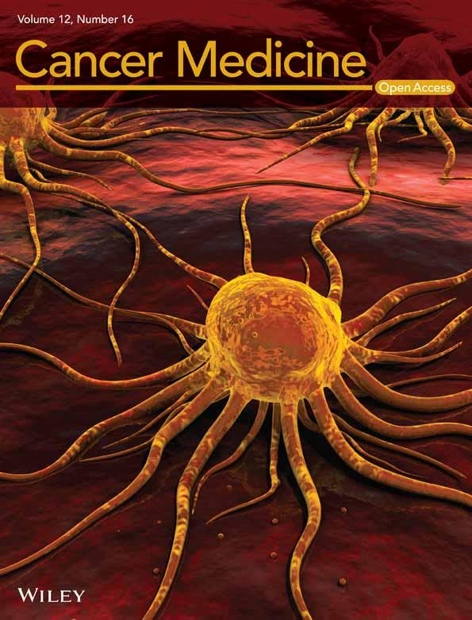

News · March 07, 2025

Mandi L. Pratt-Chapman and colleagues applied CNA to identify key difference-makers distinguishing oncology institutions that collect sexual orientation and gender identity (SOGI) data across a sample of American Society of Clinical Oncology (ASCO) members.

<h2>ABSTRACT</h2>

The purpose of this analysis was to identify key difference-making conditions that distinguish oncology institutions that collect sexual orientation and gender identity (SOGI) data across a sample of American Society of Clinical Oncology (ASCO) members.

From October to November 2020, an anonymous 54-item web-based survey was distributed to ASCO members. Coincidence analysis was used to identify difference-making conditions for the collection of SOGI data.

ASCO members' responses to just three items consistently distinguished practices that reported collecting both SO and GI data (n = 25) from those who did not (n = 20): (1).“Do you ask your patients what pronouns they want you to use for them?”; (2) “Institutional leadership supports collecting SOGI data from patients”; and (3)“Does the electronic health record (EHR) at your institution have a specific section to collect information about patients' SOGI?” The positive model exhibited both reliability (consistency = 0.87, or 20/23) and explanatory breadth (coverage = 0.80, or 20/25). The negative model for SOGI data collection consisted of different responses to the same three items and likewise showed both reliability (consistency = 0.94, or 16/17) and explanatory breadth (coverage = 0.80, or 16/20).

Specific levels of leadership support, frequency of asking patients about pronouns, and the presence or absence of EHR record structure were difference-makers for collecting SOGI data in this sample. The study underscores the importance of leadership support, structured data fields, and attention to patient pronouns, which are aligned with the ASCO and National Institutes of Health calls to action.

<strong>Publication</strong>
Pratt-Chapman, M.L., Miech, E.J., Mullins, M.A., Chang, S., Quinn, G.P., Maingi, S., Schabath, M.B. and Kamen, C. (2025), Difference-Makers for Collecting Sexual Orientation and Gender Identity Data in Oncology Settings. Cancer Med, 14: e70727. <a href="https://doi.org/10.1002/cam4.70727">https://doi.org/10.1002/cam4.70727</a>

<a href="../news.html">← All news</a>

