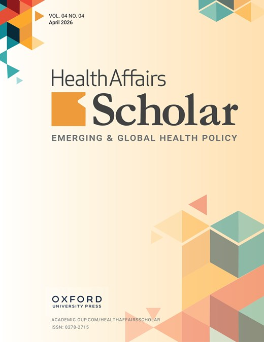

News · April 17, 2026

John Rich, Edward Miech, Kate Mackie, Deborah Cragun, Eve Shapiro, Sage Kim, Minyoung Do, Jessica Bishop-Royse, David Ansell, and Theodore Corbin use CNA to identify the social factors that link to low life expectancy across Chicago's 77 community areas.

<h2>Abstract</h2>

Life expectancy gaps between downtown Chicago and communities on the west and south approach 25 years. Multiple social factors relate to this gap, but identifying which are "difference-makers" is challenging. Using data from the Chicago Health Atlas, the authors analyzed 34 social factors with a configurational approach to identify the minimum set of factors necessary and sufficient for low life expectancy across Chicago's 77 community areas.

The analysis identified three factors&mdash;high rates of low birth weight, high unemployment, and high non-fatal shootings&mdash;that were directly linked to low life expectancy across three pathways: (1) high rates of low birth weight AND high unemployment, OR (2) high non-fatal shootings AND high rates of low birth weight, OR (3) high non-fatal shootings AND high unemployment. The authors further explored whether high residential segregation was an antecedent to these pathways and found that it directly linked to high rates of low birth weight, which&mdash;when combined with high unemployment and high non-fatal shootings&mdash;linked to low life expectancy.

Understanding how the interplay of social factors contributes to the complex phenomenon of low life expectancy can help policymakers add precision and nuance to public health efforts to close life expectancy gaps.

<strong>Publication</strong>
Rich, J., Miech, E., Mackie, K., Cragun, D., Shapiro, E., Kim, S., Do, M., Bishop-Royse, J., Ansell, D., Corbin, T. (2026), How segregation, low birth weight, unemployment, and violence link to low life expectancy in Chicago, Health Affairs Scholar 4(4), qxag080. <a href="https://doi.org/10.1093/haschl/qxag080">https://doi.org/10.1093/haschl/qxag080</a>

<a href="../news.html">← All news</a>

