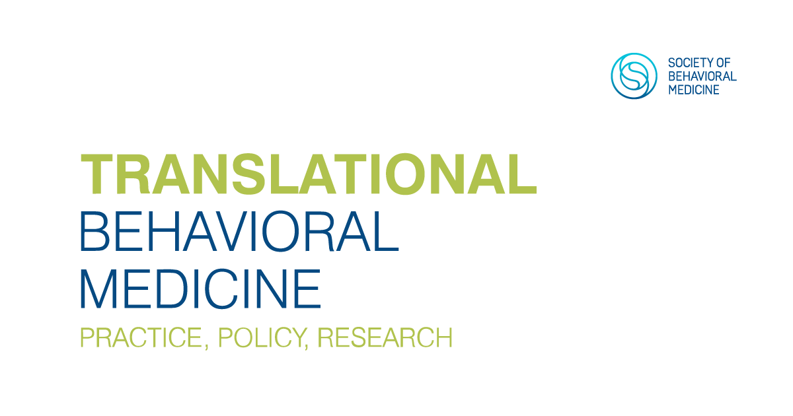

News · May 22, 2023

Laura J Damschroder et al. (2022) conducted a Coincidence Analysis of obesity treatment options within the Veterans Health Administration, which was selected "Editor's Choice" by Translational Behavioral Medicine.

<h2>Abstract</h2>

Obesity is a well-established risk factor for increased morbidity and mortality. Comprehensive lifestyle interventions, pharmacotherapy, and bariatric surgery are three effective treatment approaches for obesity. The Veterans Health Administration (VHA) offers all three domains but in different configurations across medical facilities. Study aim was to explore the relationship between configurations of three types of obesity treatments, context, and population impact across VHA using coincidence analysis. This was a cross-sectional analysis of survey data describing weight management treatment components linked with administrative data to compute population impact for each facility. Coincidence analysis was used to identify combinations of treatment components that led to higher population impact. Facilities with higher impact were in the top two quintiles for (1) reach to eligible patients and (2) weight outcomes. Sixty-nine facilities were included in the analyses. The final model explained 88% (29/33) of the higher-impact facilities with 91% consistency (29/32) and was comprised of five distinct pathways. Each of the five pathways depended on facility complexity-level plus factors from one or more of the three domains of weight management: comprehensive lifestyle interventions, pharmacotherapy, and/or bariatric surgery. Three pathways include components from multiple treatment domains. Combinations of conditions formed “recipes” that lead to higher population impact. Our coincidence analyses highlighted both the importance of local context and how combinations of specific conditions consistently and uniquely distinguished higher impact facilities from lower impact facilities for weight management.

<strong>Publication</strong>
Laura J Damschroder et al. (2022), Facility-level program components leading to population impact: a coincidence analysis of obesity treatment options within the Veterans Health Administration, Translational Behavioral Medicine 12(11), 1029–1037. <a href="https://doi.org/10.1093/tbm/ibac051">https://doi.org/10.1093/tbm/ibac051</a>

<a href="../news.html">← All news</a>

