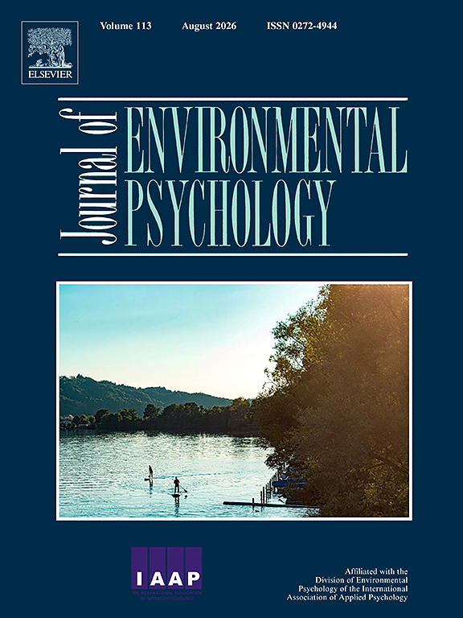

News · August 04, 2026

Henrik Johansson Rehn, Alexandre Sukhov, Lars E. Olsson, and Margareta Friman use CNA to explore the "window of opportunity" for car use reduction and to identify the causal pathways that lead people to reduce their car use.

<h2>Abstract</h2>

Understanding the drivers of behavior change and the contexts in which psychological theories apply is crucial for designing effective interventions. Life events are often seen as "windows of opportunity" for promoting more sustainable behaviors, as disruptions to daily routines can make intentions more influential by weakening habitual barriers. This paper primarily investigates this idea through an empirical case on car use reduction, using a configurational comparative method (CCM). CCM offers a case-oriented approach that complements traditional variable-oriented techniques such as regression and structural equation modeling. Because CCM is uncommon in environmental psychology research, the paper introduces its core principles and highlights how its features can generate novel insights—such as identifying outcomes shaped by multiple interacting factors (causal conjunction) and by distinct causal pathways (equifinality). The empirical analysis indicates two key patterns: (1) Car use reduction often occurred independently of corresponding intentions and other psychological predictors, challenging the applicability of combining reasoned action models and habit theory in this context. (2) Strong intentions typically stem from strong attitudes, while very strong intentions require combinations of factors, such as moral responsibility and perceived behavioral control. Overall, the findings suggest that most reductions occur spontaneously in response to external influences, whereas intentional change demands interventions targeting multiple motivational drivers simultaneously. The study demonstrates how CCM provides an accessible approach for examining theoretically recognized complexities in causal interactions, ultimately offering concrete guidance for policy and intervention design.

<strong>Publication</strong>
Rehn, H.J., Sukhov, A., Olsson, L.E., Friman, M. (2026), Exploring the "window of opportunity" for car use reduction with a configurational comparative method, Journal of Environmental Psychology 113, 103093. <a href="https://doi.org/10.1016/j.jenvp.2026.103093">https://doi.org/10.1016/j.jenvp.2026.103093</a>

<a href="../news.html">← All news</a>

