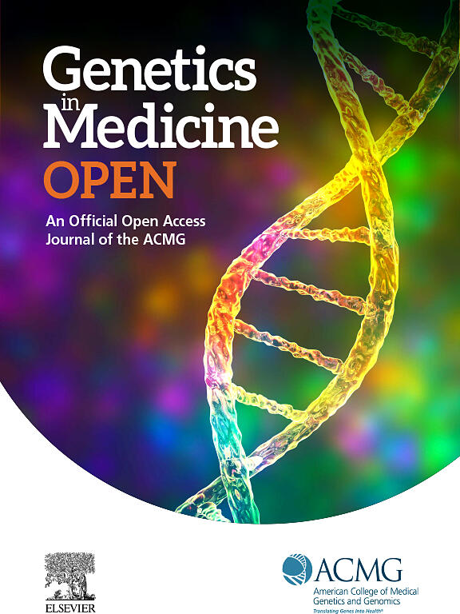

News · August 25, 2023

Dean, M, Tezak, A, Johnson, S, ... Cragun, D. used CNA to identify factors differentiating cancer risk management decisions among females with pathogenic/likely pathogenic variants in PALB2, CHEK2, and ATM. Accompanied by a podcast with Deborah Cragun.

<h2>Abstract</h2>

Following disclosure of pathogenic or likely pathogenic variants in hereditary cancer genes, patients face cancer risk management decisions. Through this mixed-methods study, we investigated cancer risk management decisions among females with pathogenic or likely pathogenic variants in PALB2, CHEK2, and ATM to understand why some patients follow National Comprehensive Cancer Network guidelines, whereas others do not.

Survey and interview data were cross-analyzed using a 3-stage approach. Identified factors were used to conduct coincidence analysis and differentiate between combinations of factors that result in following or not following guidelines.

Of the 13 participants who underwent guideline inconsistent prophylactic surgery, 12 fit 1 of 3 unique patterns: (1) cancer-related anxiety in the absence of trust in care, (2) provider recommending surgery inconsistent with National Comprehensive Cancer Network guidelines, or (3) surgery occurring before genetic testing. Two unique patterns were found among 18 of 20 participants who followed guidelines: (1) anxiety along with trust in care or (2) lack of anxiety and no prophylactic surgery before testing.

Health care provider recommendations and trust in care may influence whether individuals receive care that is congruent with risk levels conferred by specific genes. Interventions are needed to improve provider knowledge, patient trust in non-surgical care, and patient anxiety.

Deborah Cragun (University of South Florida) talks about this paper and the value of CNA in this podcast.

<strong>Publication</strong>
Dean, M, Tezak, A, Johnson, S, Weidner, A, Almanza, D, Pal, T, Cragun, D. (2023), Factors that Differentiate Cancer Risk Management Decisions Among Females with Pathogenic/Likely Pathogenic Variants in PALB2, CHEK2, and ATM, Genetics in Medicine, 25, 100945. <a href="https://doi.org/10.1016/j.gim.2023.100945">https://doi.org/10.1016/j.gim.2023.100945</a>

<a href="../news.html">← All news</a>

