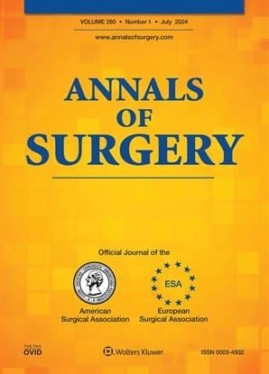

News · April 22, 2025

Reiping Huang and colleagues applied CNA in the field of surgery and published their results in the world's most highly referenced surgery journal: Annals of Surgery. Their study explains the successful implementation of hospital enhanced recovery programs (ERPs) through unique configurations of contextual and implementation conditions.

<h2>Abstract</h2>

This study explains successful implementation of hospital enhanced recovery programs (ERPs) through unique configurations of contextual and implementation conditions.

Despite proven benefits in improving surgical outcomes, ERPs are often ineffectively implemented in hospitals, possibly due to the complex ways in which the interventions, local environment contexts, and implementation processes intertwine.

Using coincidence analysis, a mathematical method for analyzing configurations, we identified sufficient and necessary conditions for ERP implementation success in a national surgical collaborative. Success (high improvement) was defined as being among the 25% of hospitals with the greatest improvement in ERP adherence rate over time. Explanatory conditions included implementation resources in five domains (knowledge of evidence supporting interventions, leadership support, team skills and cohesion, stakeholder buy-in, and appropriate workload and time), organizational readiness to change, and hospital characteristics (teaching status, bed size, surgical volume, and socioeconomic status (SES) of patient populations). Prevalence-adjusted (PA) consistency and contrapositive (PAC) coverage, measures of data fit, were used in model selection adjusting for outcome prevalence.

Of the 86 hospitals, 26 (30.2%) successfully implemented ERP. Three scenarios collectively explained success for &gt;70% of the hospitals (PA consistency=0.719, PAC coverage=0.752): Low-SES hospitals ready to change despite lacking team skills and cohesion during implementation; hospitals with low surgical volume which were ready to change and had strong staff buy-in; and high-volume hospitals that lacked leadership support but had appropriate workload and sufficient time for implementation rollout.

Successful ERP implementation varied by local context and relied on organizational readiness to change, strong staff buy-in, appropriate workload and sufficient time.

<strong>Publication</strong>
Huang, Reiping PhD*,†; Remer, Sarah L. MD*,‡; Knapp, Leandra K. MS*; Cohen, Mark E. PhD*; Rosen, Michael A. PhD§; Hall, Bruce L. MD, PhD, MBA, FACS*,∥; Wick, Elizabeth C. MD¶; Ko, Clifford Y. MD, MS, MSHS, FACS*,#. Hospital Configurations Leading to Successful Implementation of Enhanced Recovery Programs. Annals of Surgery ():, April 16, 2025. |. <a href="https://doi.org/10.1097/SLA.0000000000006731">https://doi.org/10.1097/SLA.0000000000006731</a>

<a href="../news.html">← All news</a>

