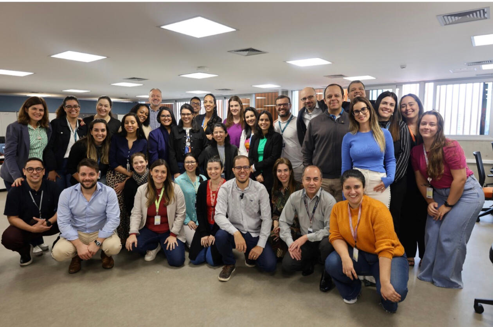

News · December 05, 2024

On October 10 and 11, 2024, Dr. Jonathan Freitas (UFMG/Brazil) conducted an introductory CNA course at the Clinical Hospital of the School of Medicine at the University of São Paulo (HC/FMUSP). The course brought together approximately 30 members of HC’s Digital Health team. The event received exceptional feedback, sparking follow-up research initiatives centered on the CNA method.

On October 10 and 11, 2024, Dr. Jonathan Freitas (UFMG/Brazil) conducted an introductory CNA course at the Clinical Hospital of the School of Medicine at the University of São Paulo (HC/FMUSP). As one of the country’s most prominent healthcare institutions, HC serves millions annually, including 1,000,000 outpatient consultations, 230,000 emergency visits, and 50,000 surgeries, supported by a team of over 21,000 professionals.

The course brought together approximately 30 members of HC’s Digital Health team, whose mission is to expand the hospital’s impact through innovative remote care technologies. Attendees included distinguished leaders such as São Paulo State Health Secretary Dr. Priscilla Perdicaris, HC’s Administrative Director of Digital Health Paula Scudeller, and former IBM Brazil CEO Ricardo Pellegrini. The event received exceptional feedback, sparking follow-up research initiatives centered on the CNA method.

With 8 hours of in-depth training, the course was organized by Techni Methods (https://www.technimethods.com.br/), which is also sponsoring the development of an online version. The first online edition, recorded in Portuguese with English subtitles, is set to launch in early 2025, with the English version, supervised by Prof. Michael Baumgartner and Dr. Edward Miech, following in mid-2025.

Stay updated about the online course launch—click here to subscribe!

<strong>Publication</strong>
Stay updated about the online course launch—click here to subscribe!

<a href="../news.html">← All news</a>

