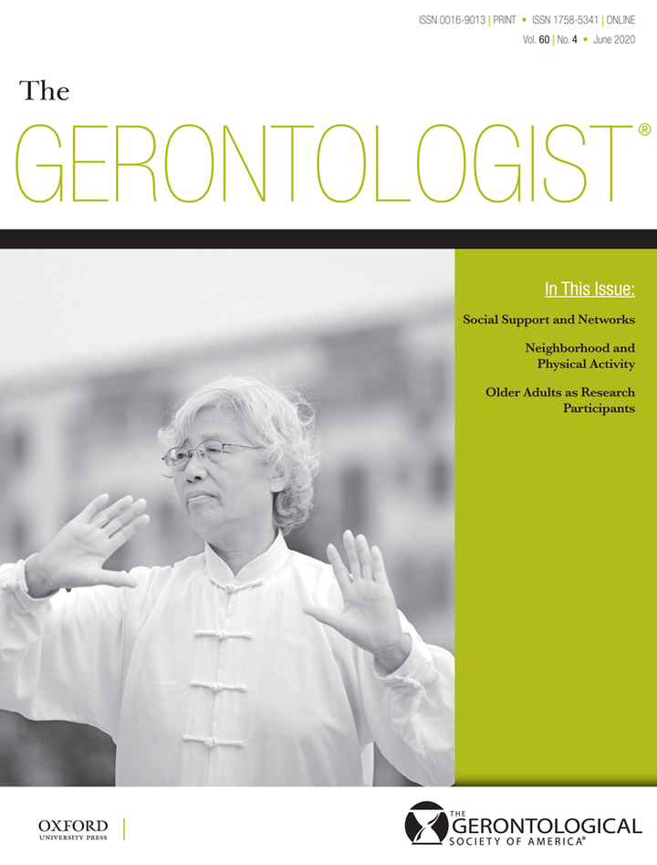

News · May 24, 2020

Susan Hickman et al. (2020) published an article entitled "Identifying the Implementation Conditions Associated With Positive Outcomes in a Successful Nursing Facility Demonstration Project" in the Gerontologist. They analyze their data using Coincidence Analysis.

S. E. Hickman, E. Miech et al. (2020), Identifying the Implementation Conditions Associated With Positive Outcomes in a Successful Nursing Facility Demonstration Project , The Gerontologist, doi: 10.1093/geront/gnaa041

<ul class="cna-news-list"><li>Twitter</li><li>LinkedIn</li><li>Facebook</li></ul>

<a href="../news.html">← All news</a>

