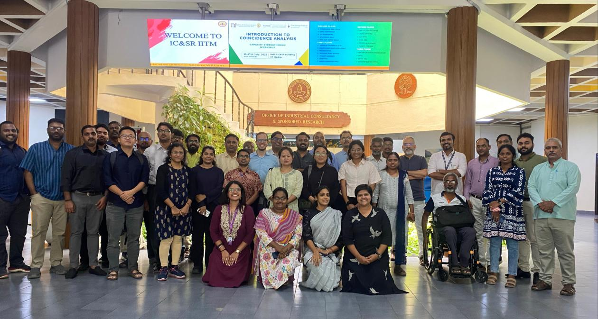
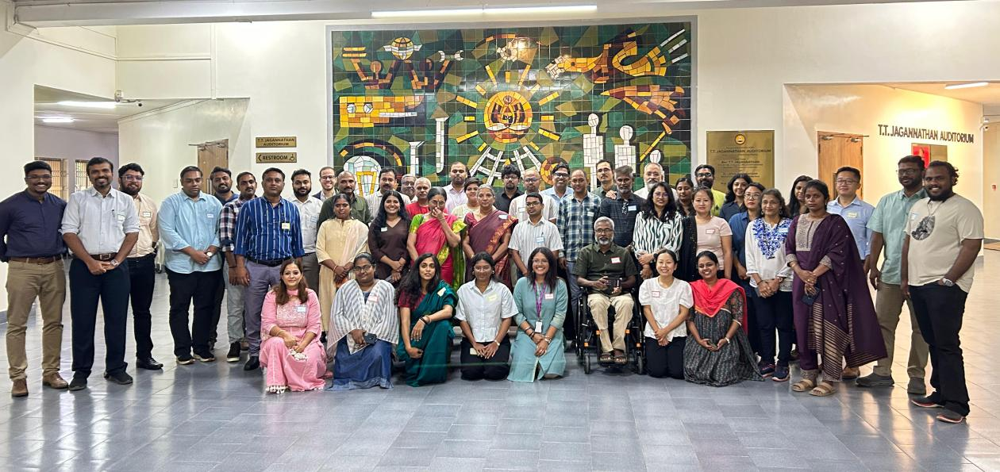
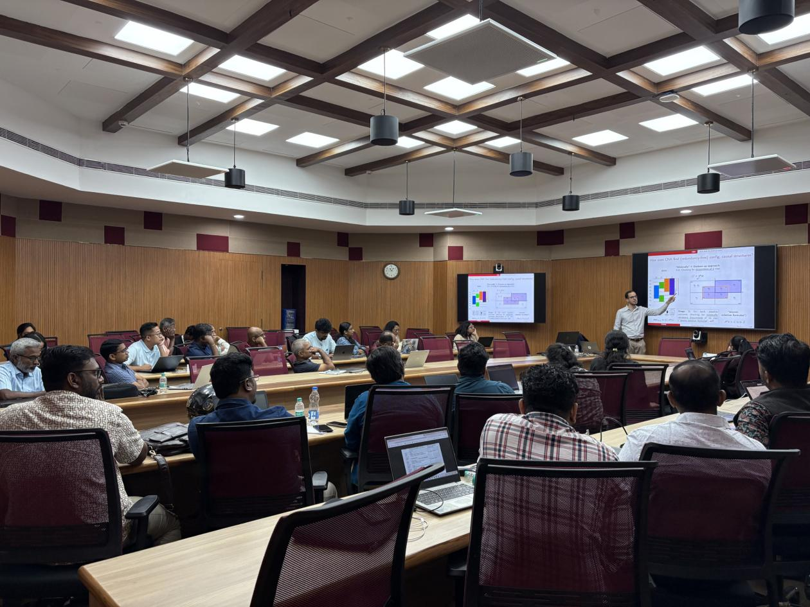
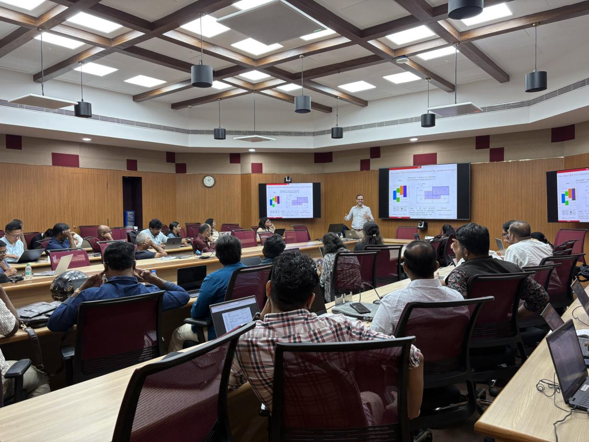
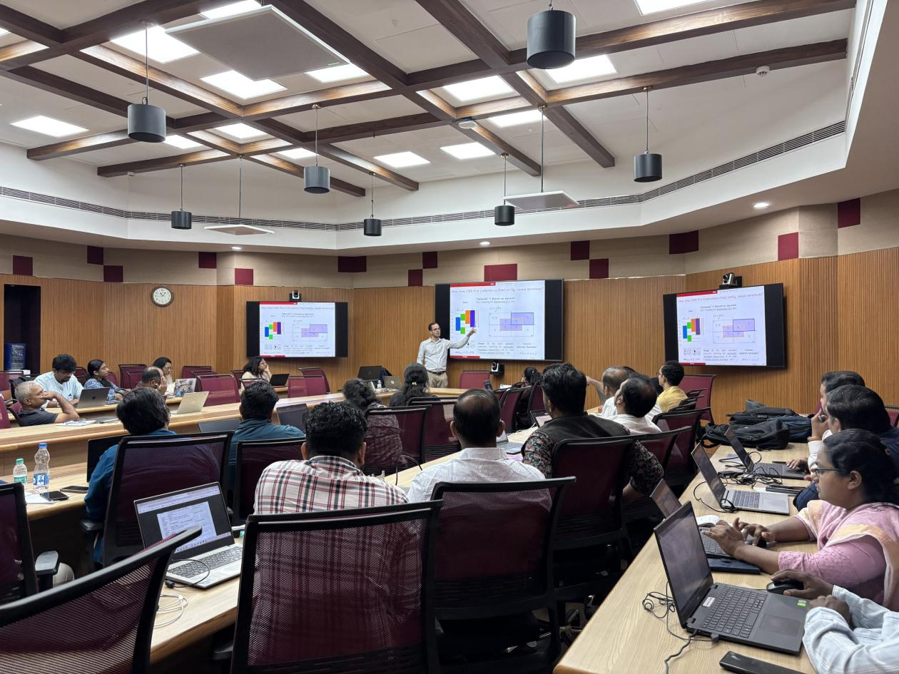

News · August 07, 2025

In July 2025, the PATANG team at The George Institute for Global Health (TGI) organized two CNA training workshops in Asia: one in Bali, Indonesia, in collaboration with the International Health Economics Association (IHEA), and one at the Indian Institute of Technology Madras, co-hosted by the Centre for Technology and Policy.

In July 2025, the PATANG team at The George Institute for Global Health (TGI) organized a series of events aimed at advancing dialogue, knowledge, and capacity in the fields of community action for health and advanced causal analysis methods. These gatherings brought together global scholars, policymakers, practitioners, and early-career researchers in India and abroad, fostering a rich environment for critical reflection and hands-on methodological learning.

The first of these events was held on 19 July 2025 in Bali, Indonesia, where PATANG, in collaboration with the International Health Economics Association (IHEA), hosted a pre-conference workshop titled “Introduction to Coincidence Analysis (CNA).” This half-day session marked the first formal introduction of the CNA method to a global audience of health economics and policy researchers. The workshop included lectures on foundational concepts such as “What is causal data analysis?”, “What is meant by configurational?”, and “What is a cause?” Participants engaged in hands-on activities including CNA matrix-building exercises, enabling them to understand the method’s potential for identifying complex causal pathways. The session drew strong participation from 40 professionals and academics affiliated with leading institutions across the world, including Johns Hopkins Bloomberg School of Public Health, London School of Hygiene &amp; Tropical Medicine, University of Sydney, University of Melbourne, Seoul National University, University of York, National University of Singapore, and many others. Of this group, 25 have signed on to stay engaged with PATANG and join the global community of practice working on CNA.

On 25 July 2025, the team convened a high-level expert panel discussion titled “Community Action for Health in Tamil Nadu: Legacies, Lessons, and Future Directions” at the Indian Institute of Technology Madras, co-hosted by the Centre for Technology and Policy, and the PATANG project partner SOCHARA. Following the panel, from 25–27 July 2025, the PATANG team conducted a three-day workshop on “Introduction to Coincidence Analysis (CNA)”, marking the first formal introduction of CNA method in India as part of a broader effort to build capacity in configurational comparative methods and causal complexity in health policy and systems research. The workshop was facilitated by invited faculty Dr. Jonathan Simões Freitas (Federal University of Minas Gerais, Brazil), in collaboration with Techni Methods. Over 40 participants from a diverse set of institutions—including Indian Council of Medical Research - National Institute of Epidemiology (ICMR-NIE), JIPMER Puducherry, SCTIMST Trivandrum, State Health Resource Centre Chhattisgarh, Goa Institute of Management, St. John’s Medical College, Access Health International, SOCHARA, MSSRF, Anusandhan Trust (SATHI), National Health Missions of Tamil Nadu and Nagaland, as well as PATANG teams from multiple states—took part in this intensive training. The sessions covered core topics such as causal data analysis, model building, and dealing with ambiguity in complex systems. Participants also engaged with case-based exercises and matrix construction for CNA modelling.

The training received an overwhelmingly positive response, reflecting a growing demand for capacity in advanced causal inference methods across the health research ecosystem in India.

Taken together, these events mark a milestone in PATANG’s efforts to build a robust ecosystem for community-engaged, methodologically rigorous health systems research in India and beyond. The introduction of CNA not only opens new avenues for causal inquiry but also complements the team’s ongoing work to understand local configurations, actionable pathways, and shared governance mechanisms for more equitable health outcomes.

<figure><figcaption>Group Bali</figcaption></figure>
<figure><figcaption>Dr. Freitas teaching</figcaption></figure>
<figure><figcaption>Dr. Freitas teaching</figcaption></figure>
<figure><figcaption>Dr. Freitas teaching</figcaption></figure>

<a href="../news.html">← All news</a>

