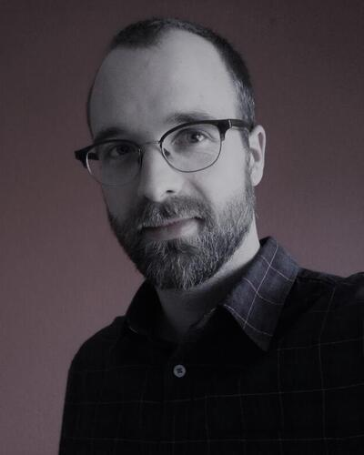

News · March 11, 2021

Christoph Falk (PhD 2020, Geneva) has joined the CNA project as a part-time researcher.

Christoph Falk received his PhD degree in Philosophy from the University of Geneva, Switzerland, in 2020. His research focuses on developing theoretical foundations and algorithms for uncovering complex causal structures. In his PhD thesis, he developed a regularity theory of causation, an algebraic fundament for configurational causal modeling as well as his own method of configurational data analysis. In the CNA project, he is now working on comparing CNA to related methods (e.g. Logic Regression) and exploring synergy potentials. More about Christoph and his research can be found here.

<ul class="cna-news-list"><li>Twitter</li><li>LinkedIn</li><li>Facebook</li></ul>

<a href="../news.html">← All news</a>

