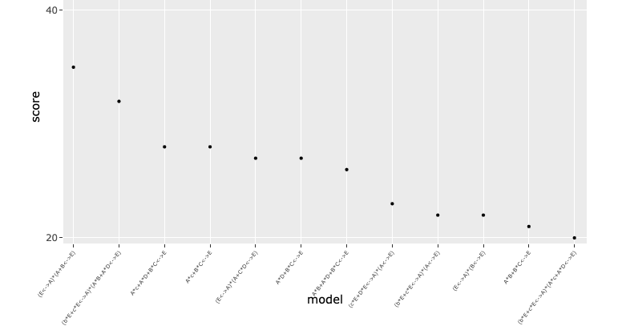

News · September 19, 2022

In a series of news articles, Veli-Pekka Parkkinen informs about new developments concerning the frscore package for CNA robustness analysis. To make the best of frscore, users are encouraged to follow these updates.

For those using or interested in the CNA extension package frscore, a series of short articles about upcoming changes in the package, and about how to minimize pain when working with the functions, will be published at Veli-Pekka's website. The first post in the series considers how to visualize the sometimes overwhelming output of the main functions.

<ul class="cna-news-list"><li>Twitter</li><li>LinkedIn</li><li>Facebook</li></ul>

<a href="../news.html">← All news</a>

