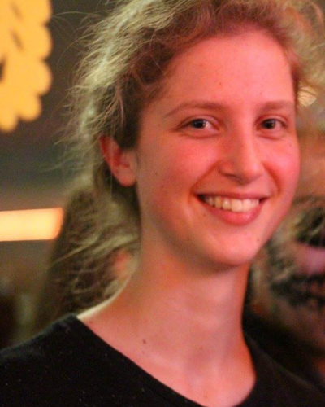

News · January 24, 2022

The CNA group has the pleasure to welcome Luna de Souter to the team.

Luna de Souter has joined the CNA group from KU Leuven, Belgium. She has a Bachelor of Philosophy and a Master of Statistics, and she will pursue a PhD in the field of causal inference and modeling under the supervision of Michael Baumgartner.

For more on Luna click here.

<a href="../news.html">← All news</a>

