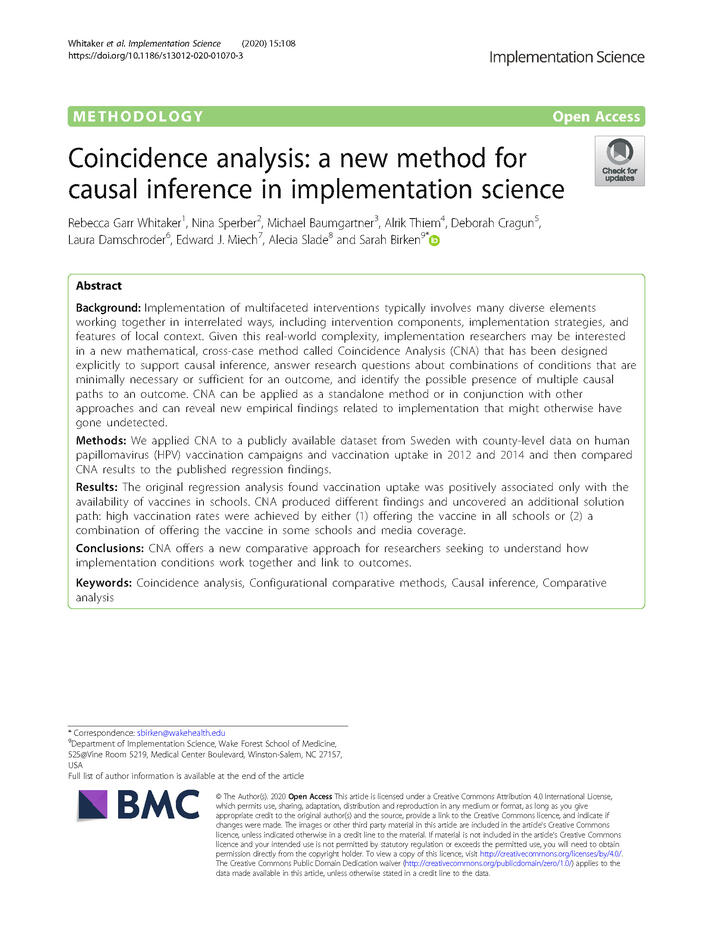

News · December 14, 2020

The CNA method has been showcased in the flagship journal of implementation science.

Implementation of multifaceted interventions typically involves many diverse elements working together in interrelated ways, including intervention components, implementation strategies, and features of local context. Given this real-world complexity, implementation researchers may be interested in a new mathematical, cross-case method called Coincidence Analysis (CNA) that has been designed explicitly to support causal inference, answer research questions about combinations of conditions that are minimally necessary or sufficient for an outcome, and identify the possible presence of multiple causal paths to an outcome. CNA can be applied as a standalone method or in conjunction with other approaches and can reveal new empirical findings related to implementation that might otherwise have gone undetected.

We applied CNA to a publicly available dataset from Sweden with county-level data on human papillomavirus (HPV) vaccination campaigns and vaccination uptake in 2012 and 2014 and then compared CNA results to the published regression findings.

The original regression analysis found vaccination uptake was positively associated only with the availability of vaccines in schools. CNA produced different findings and uncovered an additional solution path: high vaccination rates were achieved by either (1) offering the vaccine in all schools or (2) a combination of offering the vaccine in some schools and media coverage.

CNA offers a new comparative approach for researchers seeking to understand how implementation conditions work together and link to outcomes.

<figure><figcaption>first page</figcaption></figure>

<strong>Publication</strong>
Whitaker, R.G., Sperber, N., Baumgartner, M. et al. Coincidence analysis: a new method for causal inference in implementation science. Implementation Sci 15, 108 (2020). <a href="https://doi.org/10.1186/s13012-020-01070-3">https://doi.org/10.1186/s13012-020-01070-3</a>

<a href="../news.html">← All news</a>

