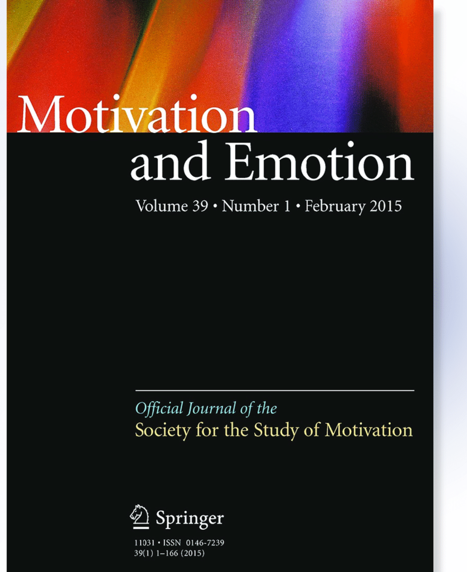

News · October 01, 2021

Martyna Swiatczak's paper entitled "Towards a neo-configurational theory of intrinsic motivation" was published in Motivation and Emotion (2021): https://doi.org/10.1007/s11031-021-09906-1

Towards a neo-configurational theory of intrinsic motivation

This research seeks to improve our understanding of how intrinsic motivation is instantiated. Three motivation theories, flow theory, self-determination theory, and empowerment theory, have informed our understanding of the foundations of intrinsic motivation at work. Taken jointly, they suggest six causal factors for intrinsic motivation: (1) perceived competence, (2) perceived challenge, (3) perceived autonomy, (4) perceived impact, (5) perceived social relatedness, and (6) perceived meaningfulness. Integrating different theoretical perspectives, I employ a case-based configurational approach and conduct coincidence analyses on survey data from a German public utility to analyse the nuanced interplay of these six causal factors for intrinsic motivation. My data show that high perceived meaningfulness or high perceived autonomy is sufficient for high perceived intrinsic motivation and at least one of the two conditions must be present. Further, my findings reveal a common cause structure in which perceived impact is not a causal factor for intrinsic motivation but an additional outcome factor. Subsequent analyses shed light on possible roles of the remaining proposed causal factors by drawing a tentative causal chain structure. The results of this study enhance our understanding of the causal complexity underlying the formation of intrinsic motivation.

<strong>Publication</strong>
Swiatczak, M.D. Towards a neo-configurational theory of intrinsic motivation. Motiv Emot (2021). <a href="https://doi.org/10.1007/s11031-021-09906-1">https://doi.org/10.1007/s11031-021-09906-1</a>

<a href="../news.html">← All news</a>

