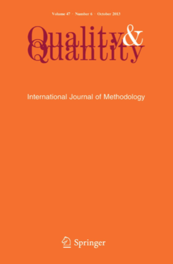

News · August 16, 2021

Martyna Swiatczak's paper on "Different algorithms, different models" was published in Quality &amp; Quantity (2021): https://doi.org/10.1007/s11135-021-01193-9

Different algorithms, different models

This study assesses the extent to which the two main Configurational Comparative Methods (CCMs), i.e. Qualitative Comparative Analysis (QCA) and Coincidence Analysis (CNA), produce different models. It further explains how this non-identity is due to the different algorithms upon which both methods are based, namely QCA's Quine–McCluskey algorithm and the CNA algorithm. I offer an overview of the fundamental differences between QCA and CNA and demonstrate both underlying algorithms on three data sets of ascending proximity to real-world data. Subsequent simulation studies in scenarios of varying sample sizes and degrees of noise in the data show high overall ratios of non-identity between the QCA parsimonious solution and the CNA atomic solution for varying analytical choices, i.e. different consistency and coverage threshold values and ways to derive QCA's parsimonious solution. Clarity on the contrasts between the two methods is supposed to enable scholars to make more informed decisions on their methodological approaches, enhance their understanding of what is happening behind the results generated by the software packages, and better navigate the interpretation of results. Clarity on the non-identity between the underlying algorithms and their consequences for the results is supposed to provide a basis for a methodological discussion about which method and which variants thereof are more successful in deriving which search target.

<strong>Publication</strong>
Swiatczak, M.D. Different algorithms, different models. Qual Quant (2021). <a href="https://doi.org/10.1007/s11135-021-01193-9">https://doi.org/10.1007/s11135-021-01193-9</a>

<a href="../news.html">← All news</a>

