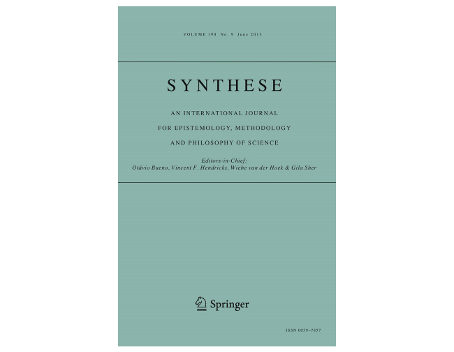

News · June 07, 2022

Veli-Pekka Parkkinen argues that variable relativity is good, in a paper that recently appeared in Synthese: Parkkinen, VP. Variable relativity of causation is good. Synthese 200, 194 (2022). https://doi.org/10.1007/s11229-022-03676-0

Abstract

Interventionism is a theory of causation with a pragmatic goal: to define causal concepts that are useful for reasoning about how things could, in principle, be purposely manipulated. In its original presentation, Woodward’s (2003) interventionist definition of causation is relativized to an analyzed variable set. In Woodward (2008), Woodward changes the definition of the most general interventionist notion of cause, contributing cause, so that it is no longer relativized to a variable set. This derelativization of interventionism has not gathered much attention, presumably because it is seen as an unproblematic way to save the intuition that causal relations are objective features of the world. This paper first argues that this move has problematic consequences. Derelativization entails two concepts of unmediated causal relation that are not coextensional, but which nonetheless do not entail different conclusions about manipulability relations within any given variable set. This is in conflict with the pragmatic orientation at the core of interventionism. The paper then considers various approaches for resolving this tension but finds them all wanting. It is concluded that interventionist causation should not be derelativized in the first place. Various considerations are offered rendering that conclusion acceptable.

<strong>Publication</strong>
Parkkinen, VP. Variable relativity of causation is good. Synthese 200, 194 (2022). <a href="https://doi.org/10.1007/s11229-022-03676-0">https://doi.org/10.1007/s11229-022-03676-0</a>

<a href="../news.html">← All news</a>

