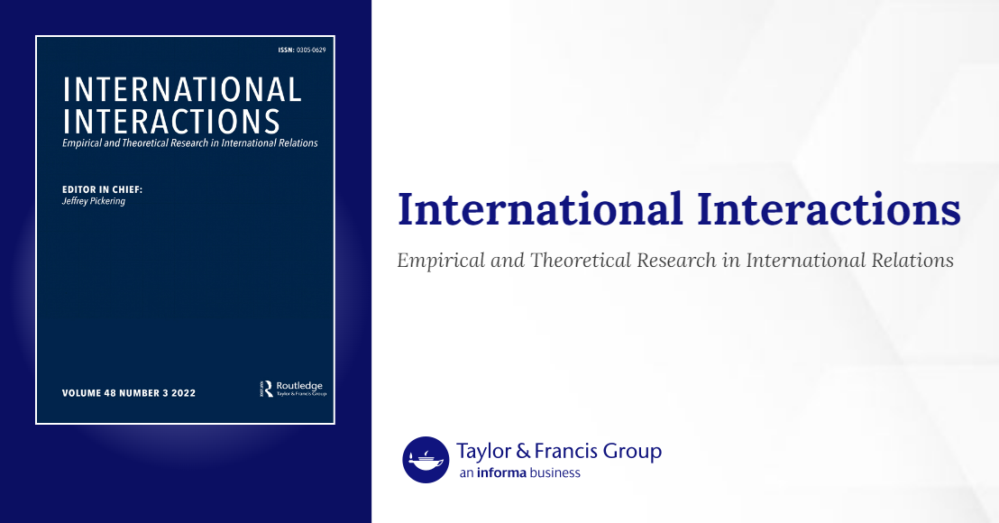

News · April 10, 2023

Tim Haesebrouck applied the frscore routine in an exemplary manner to examine the conditions under which populist radical right parties support military deployment decisions in national parliaments: Haesebrouck T. (2023), The populist radical right and military intervention: A coincidence analysis of military deployment votes, International Interactions, doi: 10.1080/03050629.2023.2184815

<h2>Abstract</h2>

Although populist radical right (PRR) parties have been studied intensively for the last few decades, only very few comparative studies on the parliamentary behavior of PRR parties have been conducted. This article aims to fill this gap in academic research by examining the pattern of PRR voting on military deployments. More specifically, it examines under what conditions PRR parties support military deployment decisions in national parliaments. The results of our analysis indicate that PRR parties are more inclined to vote in favor of contributions to operations that are deployed to balance the threat of Jihadi terrorism. However, the majority of PRR party votes on military deployments is not determined by factors related to the operation in which forces are deployed, but is driven by the expected impact of the parliamentary vote on the PRR parties’ broader vote-, office- and policy-seeking objectives. This expected impact, in turn, is determined by a complex interplay between party size, government experience, the party’s level of anti-elitism and the ideological composition of the government.

<strong>Publication</strong>
Haesebrouck T. (2023), The populist radical right and military intervention: A coincidence analysis of military deployment votes, International Interactions. <a href="https://doi.org/10.1080/03050629.2023.2184815">https://doi.org/10.1080/03050629.2023.2184815</a>

<a href="../news.html">← All news</a>

