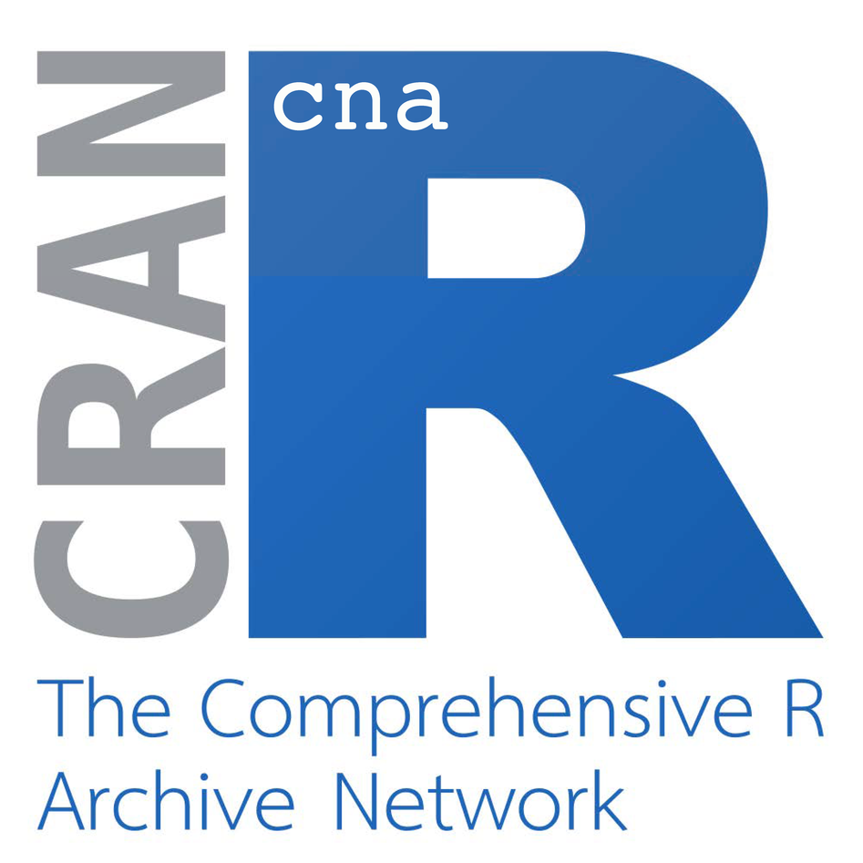

News · April 06, 2025

Mathias Ambühl and Michael Baumgartner released version 4.0.0 of the cna R package on CRAN. Many new measures for sufficiency and necessity evaluation are now available for CNA model building.

On April 4, 2025, version 4.0.0 of the cna R package was released on CRAN. As always, it can be downloaded here:

https://CRAN.R-project.org/package=cna

Here are the changes in more detail:

Changes in version 4.0.0

<ul class="cna-news-list"><li>cna() accepts alternative definitions of consistency and coverage. Users can change their selection of definitions and specify their choice in the new argument measures.</li><li>The vignette has been thoroughly revised to introduce these new definitions/measures.</li><li>Correspondingly, con/cov measures can be selected in condition(), condTbl() and other functions.</li><li>New function detailMeasures() is available at the user level (previously present but not visible).</li><li>New functions showMeasures(), showConCovMeasures() and showDetailMeasures() list available summary measures for configuration tables.</li><li>The implementation logic of secondary (fine-tuning) parameters in cna() has been revised. In particular, parameters that are not relevant for the ordinary user have been outsourced to a new function cnaControl().</li><li>The building of complex solution formulas (csf) has been changed such that csf that are submodels of other csf are no longer returned by the function csf().</li><li>New function fs2cs() is available at the user level (previously present but not visible).</li><li>Argument inus.only in cna()/cnaControl() has new default value TRUE.</li><li>The choice of columns printed by default in msc, asf and csf tables changed.</li><li>Functions and arguments that had been deprecated since V3.0 have now been removed.</li><li>More minor changes - not fully listed here.</li></ul>

<strong>Publication</strong>
De Souter, Luna and Michael Baumgartner. 2025. “New sufficiency and necessity measures for model building with Coincidence Analysis.” Zenodo. <a href="https://doi.org/10.5281/zenodo.13619580">https://doi.org/10.5281/zenodo.13619580</a>

<a href="../news.html">← All news</a>

